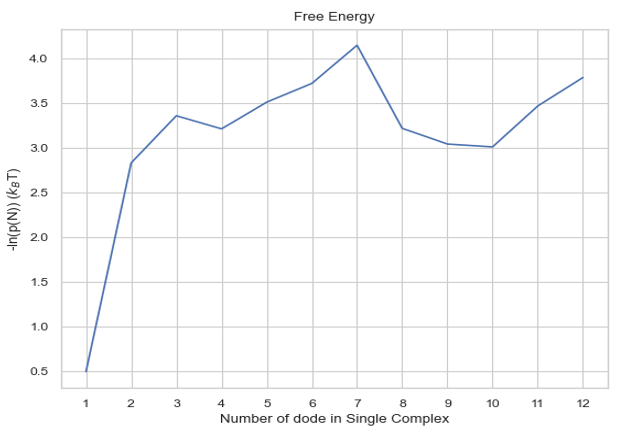
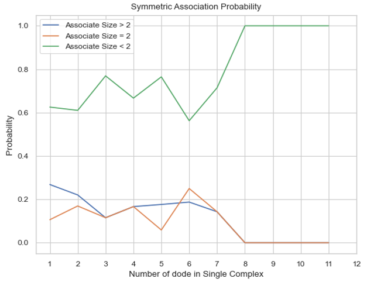
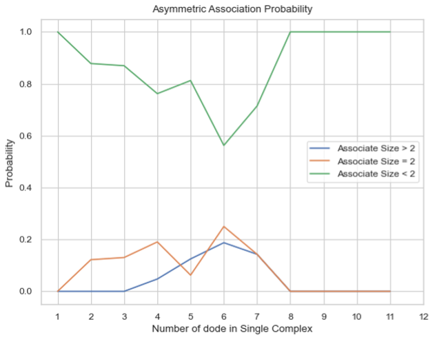
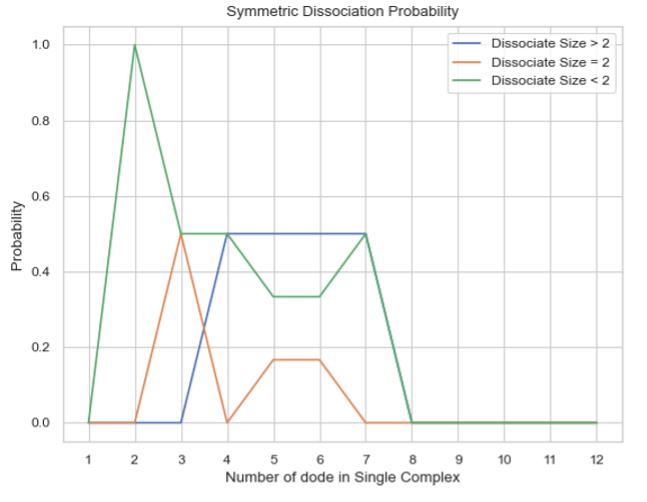
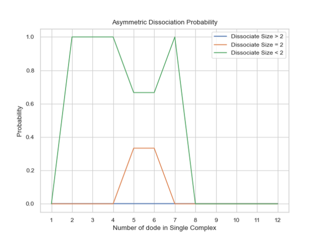
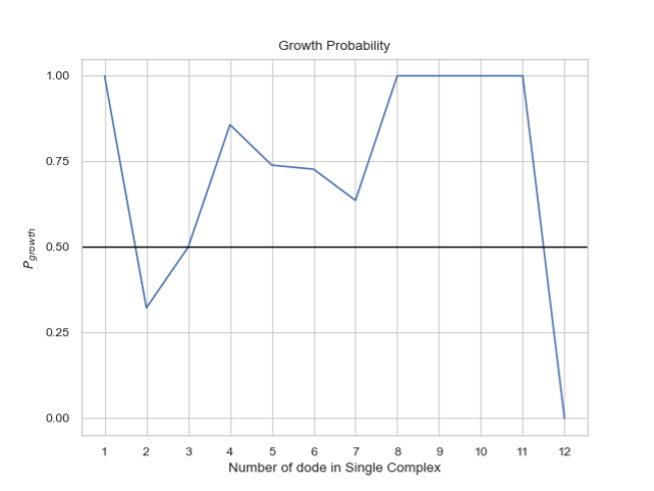
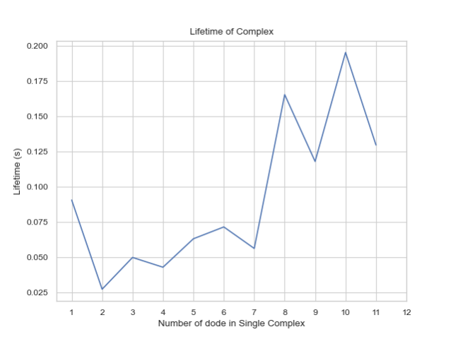

Analyzing Transition Matrix
----------------------------

The `transition_matrix_time.dat` file logs transitions between cluster sizes (n → m) and tracks the lifetimes of molecular sizes.

LINE PLOT - Calculates Change in Free Energy Among Different Sizes of Complexes
~~~~~~~~~~~~~~~~~~~~~~~~~~~~~~~~~~~~~~~~~~~~~~~~~~~~~~~~~~~~~~~~~~~~~~~~~~~~~~~

free_energy(FileName, FileNum, InitialTime, FinalTime, SpeciesName, ShowFig, SaveFig, SaveVars)

Description:
The plot indicates the change in free energy over a selected time frame among different sizes of complexes. The x-axis represents the size of the complex, and the y-axis represents the free energy calculated in units of KbT, where the probability of occurrence of the number of times an N-mer is counted (including association and dissociation) is used. If multiple input files are provided, the output plot will show the average value of all files, including an error bar.

Parameters:

- **FileName** (str): The path to the `.dat` file, usually named `transition_matrix_time.dat`, representing the histogram data to be analyzed. For multiple files, they should be named `[name]_1.dat`, `[name]_2.dat`, etc., and `FileName` should be `[name].dat`.
    
    - Example: `transition_1.dat`, `transition_2.dat` ... `FileName = transition.dat`

- **FileNum** (int): The total number of input files. If multiple files are provided, their names should follow the naming rule.

- **InitialTime** (float): The initial time in seconds to be examined. Must be smaller than `FinalTime` and greater than the start time in the file.

- **FinalTime** (float): The final time in seconds to be examined. Must be greater than `InitialTime` and smaller than the maximum time in the file.

- **SpeciesName** (str): The name of the species to be examined, which should match the name in the input (.inp and .mol) files.

- **DivideSize** (int, optional, default=2): Value that distinguishes the size of the associate complex.

- **ShowFig** (bool, optional, default=True): Whether to display the plot.

- **SaveFig** (bool, optional, default=False): Whether to save the plot as a `.png` file.

- **SaveVars** (bool, optional, default=False): Whether to save the values in text or `.csv` files. The files will be saved in a folder called `vars`.

Returns:

- **cmplx_size** (list): List of each complex size.

- **mean_energy** (list): The `-ln(p(N))` in KbT of each complex.

- **std** (list): The standard deviation of mean energy.

Example:

.. code-block:: python

    import ionerdss as ion
    cmplx_sizes, mean_energy, std = ion.free_energy(
        FileName="transition_matrix_time.dat",
        FileNum=1,
        InitialTime=0,
        FinalTime=1,
        SpeciesName="dode",
        ShowFig=True,
        SaveFig=False,
        SaveVars=True
    )

    The free energy change among different sizes of complexes.

LINE PLOT - Symmetric Probability of Association Between Complex Sizes
~~~~~~~~~~~~~~~~~~~~~~~~~~~~~~~~~~~~~~~~~~~~~~~~~~~~~~~~~~~~~~~~~~~~~~

associate_prob_symmetric(FileName, FileNum, InitialTime, FinalTime, SpeciesName, DivideSize, ShowFig, SaveFig, SaveVars)

Description:
This line plot represents the probability of association between complexes of different sizes. The x-axis represents the size of the complex, and the y-axis represents the association probability. Three lines will be shown in the plot, representing associations to complexes of sizes less than, equal to, or greater than the specified size. 'Symmetric' means that for each association event, both sizes of complexes are counted symmetrically. For example, if a trimer associates with a tetramer to form a heptamer, this event is counted twice: once as a trimer associating with a tetramer and once as a tetramer associating with a trimer. If multiple input files are provided, the output plot will show the average value of all files, including an error bar.

Parameters:

- **FileName** (str): The path to the `.dat` file, usually named `histogram_complexes_time.dat`, representing the histogram data to be analyzed. For multiple files, they should be named `[name]_1.dat`, `[name]_2.dat`, etc., and `FileName` should be `[name].dat`.
    
    - Example: `transition_1.dat`, `transition_2.dat` ... `FileName = transition.dat`

- **FileNum** (int): The total number of input files. If multiple files are provided, their names should follow the naming rule.

- **InitialTime** (float): The initial time in seconds to be examined. Must be smaller than `FinalTime` and greater than the start time in the file.

- **FinalTime** (float): The final time in seconds to be examined. Must be greater than `InitialTime` and smaller than the maximum time in the file.

- **SpeciesName** (str): The name of the species to be examined, which should match the name in the input (.inp and .mol) files.

- **DivideSize** (int, optional, default=2): Value that distinguishes the size of the associate complex.

- **ShowFig** (bool, optional, default=True): Whether to display the plot.

- **SaveFig** (bool, optional, default=False): Whether to save the plot as a `.png` file.

- **SaveVars** (bool, optional, default=False): Whether to save the values in text or `.csv` files. The files will be saved in a folder called `vars`.

Returns:

- **cmplx_size** (list): List of each complex size.

- **mean_associate_probability** (list): The probability of a certain size of complex becoming another larger size.

- **std** (list): The standard deviation of mean probability.

Example:

.. code-block:: python

    import ionerdss as ion
    cmplx_size, mean_associate_probability, std = ion.associate_prob_symmetric(
        FileName="transition_matrix_time.dat",
        FileNum=1,
        InitialTime=0,
        FinalTime=1,
        SpeciesName="dode",
        DivideSize=2,
        ShowFig=True,
        SaveFig=False,
        SaveVars=True
    )

    The symmetric probability of association between complex sizes.

LINE PLOT - Asymmetric Probability of Association Between Complex Sizes
~~~~~~~~~~~~~~~~~~~~~~~~~~~~~~~~~~~~~~~~~~~~~~~~~~~~~~~~~~~~~~~~~~~~~~~

associate_prob_asymmetric(FileName, FileNum, InitialTime, FinalTime, SpeciesName, DivideSize, ShowFig, SaveFig, SaveVars)

Description:
This line plot represents the probability of association between complexes of different sizes. The x-axis represents the size of the complex, and the y-axis represents the association probability. Three lines will be shown in the plot, representing associations to complexes of sizes less than, equal to, or greater than the specified size. 'Asymmetric' means that for each association event, only the smaller complex associating with the larger one is counted. For example, if a trimer associates with a tetramer to form a heptamer, this event is counted only once as a trimer associating with a tetramer. If multiple input files are provided, the output plot will show the average value of all files, including an error bar.

Parameters:

- **FileName** (str): The path to the `.dat` file, usually named `transition_matrix_time.dat`, representing the histogram data to be analyzed. For multiple files, they should be named `[name]_1.dat`, `[name]_2.dat`, etc., and `FileName` should be `[name].dat`.
    
    - Example: `transition_1.dat`, `transition_2.dat` ... `FileName = transition.dat`

- **FileNum** (int): The total number of input files. If multiple files are provided, their names should follow the naming rule.

- **InitialTime** (float): The initial time in seconds to be examined. Must be smaller than `FinalTime` and greater than the start time in the file.

- **FinalTime** (float): The final time in seconds to be examined. Must be greater than `InitialTime` and smaller than the maximum time in the file.

- **SpeciesName** (str): The name of the species to be examined, which should match the name in the input (.inp and .mol) files.

- **DivideSize** (int, optional, default=2): Value that distinguishes the size of the associate complex.

- **ShowFig** (bool, optional, default=True): Whether to display the plot.

- **SaveFig** (bool, optional, default=False): Whether to save the plot as a `.png` file.

- **SaveVars** (bool, optional, default=False): Whether to save the values in text or `.csv` files. The files will be saved in a folder called `vars`.

Returns:

- **cmplx_size** (list): List of each complex size.

- **mean_associate_probability** (list): The probability of a certain size of complex becoming another larger size.

- **std** (list): The standard deviation of mean probability.

Example:

.. code-block:: python

    import ionerdss as ion
    cmplx_size, mean_associate_probability, std = ion.associate_prob_asymmetric(
        FileName="transition_matrix_time.dat",
        FileNum=1,
        InitialTime=0,
        FinalTime=1,
        SpeciesName="dode",
        DivideSize=2,
        ShowFig=True,
        SaveFig=False,
        SaveVars=True
    )

    The asymmetric probability of association between complex sizes.

LINE PLOT - Symmetric Probability of Dissociation Between Complex Sizes
~~~~~~~~~~~~~~~~~~~~~~~~~~~~~~~~~~~~~~~~~~~~~~~~~~~~~~~~~~~~~~~~~~~~~~~

dissociate_prob_symmetric(FileName, FileNum, InitialTime, FinalTime, SpeciesName, DivideSize, ShowFig, SaveFig, SaveVars)

Description:
This line plot represents the probability of dissociation of complexes of different sizes into other complexes of different sizes. The x-axis represents the size of the complex, and the y-axis represents the dissociation probability. Three lines will be shown in the plot, representing dissociations to complexes of sizes less than, equal to, or greater than the specified size. 'Symmetric' means that for each dissociation event, both sizes of complexes are counted symmetrically. For example, if a heptamer dissociates into a tetramer and a trimer, this event is counted twice: once as a heptamer dissociating into a tetramer and once as a heptamer dissociating into a trimer. If multiple input files are provided, the output plot will show the average value of all files, including an error bar.

Parameters:

- **FileName** (str): The path to the `.dat` file, usually named `transition_matrix_time.dat`, representing the histogram data to be analyzed. For multiple files, they should be named `[name]_1.dat`, `[name]_2.dat`, etc., and `FileName` should be `[name].dat`.
    
    - Example: `transition_1.dat`, `transition_2.dat` ... `FileName = transition.dat`

- **FileNum** (int): The total number of input files. If multiple files are provided, their names should follow the naming rule.

- **InitialTime** (float): The initial time in seconds to be examined. Must be smaller than `FinalTime` and greater than the start time in the file.

- **FinalTime** (float): The final time in seconds to be examined. Must be greater than `InitialTime` and smaller than the maximum time in the file.

- **SpeciesName** (str): The name of the species to be examined, which should match the name in the input (.inp and .mol) files.

- **DivideSize** (int, optional, default=2): Value that distinguishes the size of the dissociate complex.

- **ShowFig** (bool, optional, default=True): Whether to display the plot.

- **SaveFig** (bool, optional, default=False): Whether to save the plot as a `.png` file.

- **SaveVars** (bool, optional, default=False): Whether to save the values in text or `.csv` files. The files will be saved in a folder called `vars`.

Returns:

- **cmplx_size** (list): List of each complex size.

- **mean_dissociate_probability** (list): The probability of a certain size of complex becoming another smaller size.

- **std** (list): The standard deviation of mean probability.

Example:

.. code-block:: python

    import ionerdss as ion
    cmplx_size, mean_dissociate_probability, std = ion.dissociate_prob_symmetric(
        FileName="transition_matrix_time.dat",
        FileNum=1,
        InitialTime=0,
        FinalTime=1,
        SpeciesName="dode",
        DivideSize=2,
        ShowFig=True,
        SaveFig=False,
        SaveVars=True
    )

    The symmetric probability of dissociation between complex sizes.

LINE PLOT - Asymmetric Probability of Dissociation Between Complex Sizes
~~~~~~~~~~~~~~~~~~~~~~~~~~~~~~~~~~~~~~~~~~~~~~~~~~~~~~~~~~~~~~~~~~~~~~~~

dissociate_prob_asymmetric(FileName, FileNum, InitialTime, FinalTime, SpeciesName, DivideSize, ShowFig, SaveFig, SaveVars)

Description:
This line plot represents the probability of dissociation of complexes of different sizes into other complexes of different sizes. The x-axis represents the size of the complex, and the y-axis represents the dissociation probability. Three lines will be shown in the plot, representing dissociations to complexes of sizes less than, equal to, or greater than the specified size. 'Asymmetric' means that for each dissociation event, only the smaller complex dissociating from the original one is counted. For example, if a heptamer dissociates into a tetramer and a trimer, this event is counted only once as a heptamer dissociating into a trimer. If multiple input files are provided, the output plot will show the average value of all files, including an error bar.

Parameters:

- **FileName** (str): The path to the `.dat` file, usually named `transition_matrix_time.dat`, representing the histogram data to be analyzed. For multiple files, they should be named `[name]_1.dat`, `[name]_2.dat`, etc., and `FileName` should be `[name].dat`.
    
    - Example: `transition_1.dat`, `transition_2.dat` ... `FileName = transition.dat`

- **FileNum** (int): The total number of input files. If multiple files are provided, their names should follow the naming rule.

- **InitialTime** (float): The initial time in seconds to be examined. Must be smaller than `FinalTime` and greater than the start time in the file.

- **FinalTime** (float): The final time in seconds to be examined. Must be greater than `InitialTime` and smaller than the maximum time in the file.

- **SpeciesName** (str): The name of the species to be examined, which should match the name in the input (.inp and .mol) files.

- **DivideSize** (int, optional, default=2): Value that distinguishes the size of the dissociate complex.

- **ShowFig** (bool, optional, default=True): Whether to display the plot.

- **SaveFig** (bool, optional, default=False): Whether to save the plot as a `.png` file.

- **SaveVars** (bool, optional, default=False): Whether to save the values in text or `.csv` files. The files will be saved in a folder called `vars`.

Returns:

- **cmplx_size** (list): List of each complex size.

- **mean_dissociate_probability** (list): The probability of a certain size of complex becoming another smaller size.

- **std** (list): The standard deviation of mean probability.

Example:

.. code-block:: python

    import ionerdss as ion
    cmplx_size, mean_dissociate_probability, std = ion.dissociate_prob_asymmetric(
        FileName="transition_matrix_time.dat",
        FileNum=1,
        InitialTime=0,
        FinalTime=1,
        SpeciesName="dode",
        DivideSize=2,
        ShowFig=True,
        SaveFig=False,
        SaveVars=True
    )

    The asymmetric probability of dissociation between complex sizes.

LINE PLOT - Growth Probability for Each Complex Size
~~~~~~~~~~~~~~~~~~~~~~~~~~~~~~~~~~~~~~~~~~~~~~~~~~~~

growth_prob(FileName, FileNum, InitialTime, FinalTime, SpeciesName, ShowFig, SaveFig, SaveVars)

Description:
This line plot indicates the probability of growth in size for different sizes of complexes. The x-axis represents the size of the complexes, and the y-axis represents the growth probability. If multiple input files are provided, the output plot will show the average value of all files, including an error bar.

Parameters:

- **FileName** (str): The path to the `.dat` file, usually named `transition_matrix_time.dat`, representing the histogram data to be analyzed. For multiple files, they should be named `[name]_1.dat`, `[name]_2.dat`, etc., and `FileName` should be `[name].dat`.
    
    - Example: `transition_1.dat`, `transition_2.dat` ... `FileName = transition.dat`

- **FileNum** (int): The total number of input files. If multiple files are provided, their names should follow the naming rule.

- **InitialTime** (float): The initial time in seconds to be examined. Must be smaller than `FinalTime` and greater than the start time in the file.

- **FinalTime** (float): The final time in seconds to be examined. Must be greater than `InitialTime` and smaller than the maximum time in the file.

- **SpeciesName** (str): The name of the species to be examined, which should match the name in the input (.inp and .mol) files.

- **ShowFig** (bool, optional, default=True): Whether to display the plot.

- **SaveFig** (bool, optional, default=False): Whether to save the plot as a `.png` file.

- **SaveVars** (bool, optional, default=False): Whether to save the values in text or `.csv` files. The files will be saved in a folder called `vars`.

Returns:

- **cmplx_size** (list): List of each complex size.

- **mean_growth_probability** (list): The probability of a certain size of complex growing into a larger size.

- **std** (list): The standard deviation of mean probability.

Example:

.. code-block:: python

    import ionerdss as ion
    cmplx_size, mean_growth_probability, std = ion.growth_prob(
        FileName="transition_matrix_time.dat",
        FileNum=1,
        InitialTime=0,
        FinalTime=1,
        SpeciesName="dode",
        ShowFig=True,
        SaveFig=False,
        SaveVars=True
    )

    The growth probability for each complex size.

LINE PLOT - Average Lifetime for Each Complex Type
~~~~~~~~~~~~~~~~~~~~~~~~~~~~~~~~~~~~~~~~~~~~~~~~~~

complex_lifetime(FileName, FileNum, InitialTime, FinalTime, SpeciesName, ShowFig, SaveFig, SaveVars)

Description:
This line plot indicates the average lifetime for different sizes of complexes. The x-axis represents the size of the complexes, and the y-axis represents the average lifetime in seconds. If multiple input files are provided, the output plot will show the average value of all files, including an error bar.

Parameters:

- **FileName** (str): The path to the `.dat` file, usually named `transition_matrix_time.dat`, representing the histogram data to be analyzed. For multiple files, they should be named `[name]_1.dat`, `[name]_2.dat`, etc., and `FileName` should be `[name].dat`.
    
    - Example: `transition_1.dat`, `transition_2.dat` ... `FileName = transition.dat`

- **FileNum** (int): The total number of input files. If multiple files are provided, their names should follow the naming rule.

- **InitialTime** (float): The initial time in seconds to be examined. Must be smaller than `FinalTime` and greater than the start time in the file.

- **FinalTime** (float): The final time in seconds to be examined. Must be greater than `InitialTime` and smaller than the maximum time in the file.

- **SpeciesName** (str): The name of the species to be examined, which should match the name in the input (.inp and .mol) files.

- **ShowFig** (bool, optional, default=True): Whether to display the plot.

- **SaveFig** (bool, optional, default=False): Whether to save the plot as a `.png` file.

- **SaveVars** (bool, optional, default=False): Whether to save the values in text or `.csv` files. The files will be saved in a folder called `vars`.

Returns:

- **cmplx_size** (list): List of each complex size.

- **mean_lifetime** (list): The average lifetime of each complex size in seconds.

- **std** (list): The standard deviation of the average lifetime.

Example:

.. code-block:: python

    import ionerdss as ion
    cmplx_size, mean_lifetime, std = ion.complex_lifetime(
        FileName="transition_matrix_time.dat",
        FileNum=1,
        InitialTime=0,
        FinalTime=1,
        SpeciesName="dode",
        ShowFig=True,
        SaveFig=False,
        SaveVars=True
    )

    The average lifetime for each complex type.

