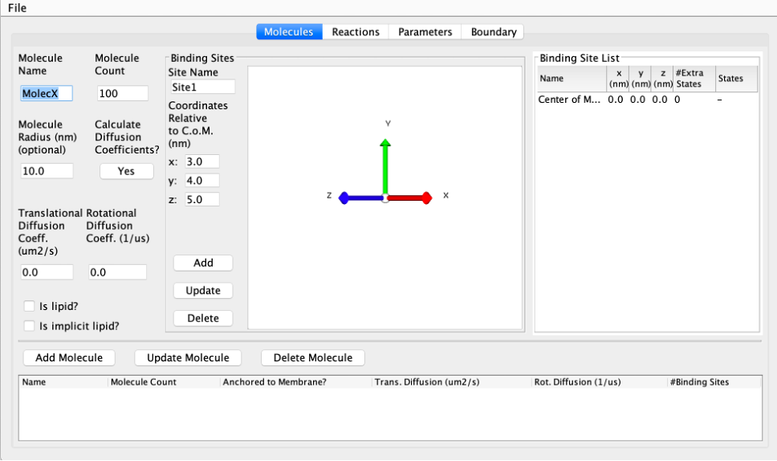
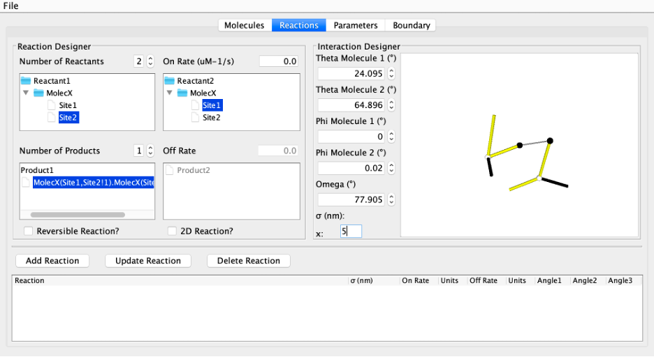

========================
Non-Equilibrium Reaction Diffusion Self-Assembly Simulator (NERDSS) Documentation
========================

User Guide
==========

Dependencies
------------

- A C++ compiler, one of the following:
    - GCC version 4.9.0 or higher
    - Intel version 16.0 or higher
    - Clang version 3.3 or higher
- GSL version 1.5 or higher
- Make version 4.2.1 or higher
- Java 8 or higher (required for the Java GUI)

Building NERDSS
---------------

To build NERDSS, navigate to the main directory `NERDSS/` and run the following command:

.. code-block:: bash

    make serial

Starting a Simulation With NERDSS
---------------------------------

To start a new simulation, you need a parameter file with a `.inp` extension and all the required `.mol` files. The `.mol` files specify the structure of specific molecules, including the location of all interfaces, as well as translational and rotational diffusion constants. The `.inp` files control reaction rules and simulation settings. All input files can be automatically generated using the `ionerdss` package or the provided JAVA GUI.

Once you have all the necessary input files correctly formatted, you can run NERDSS using the following command:

.. code-block:: bash

    ./nerdss -f <your_param_file>

Ensure that all required `.mol` files referenced by the parameter file are in the same directory as the executable.

Here are some useful flags you can use with the `nerdss` command:

.. list-table::
   :header-rows: 1

   * - Flag
     - Description
   * - ``-f <filename>``, ``--parmfile <filename>``
     - Specifies the parameter file (required).
   * - ``-s <integer>``, ``--seed <integer>``
     - Manually sets a seed for the random number generator (optional).
   * - ``-r <filename>``, ``--restart <filename>``
     - Specifies the restart file (required for restart simulation).
   * - ``-a <filename>``, ``--add <filename>``
     - During a restart, reads updated and new parameters, adding to or overriding those in the original parameter file (optional).
   * - ``--debug-force-dissoc``
     - Forces dissociation to occur whenever possible (optional, for debugging only).
   * - ``--debug-force-assoc``
     - Forces association to occur whenever possible (optional, for debugging only).

Running a Restart Simulation
----------------------------

During a normal run of NERDSS, a special file called `restart.dat` is written at intervals specified by the user (see `.inp` file parameters section). A restart simulation allows you to start a new simulation from a timestep in a previous simulation at which a restart file was written. `.inp` and `.mol` files are not required for a restart simulation.

To restart a simulation successfully, ensure the following files are in the same directory as the executable:
- Restart file (by default `restart.dat`)

- Trajectory file (optional): A new trajectory file will be created if not provided. If restarting the simulation from a checkpoint, modify the input trajectory file to make it consistent with the restart timepoint, or restart the simulation without the input trajectory file and concatenate all the trajectory files after the simulation.

- `rng_state` file (optional): To restart using the exact same sequence of random numbers, you will need the `rng_state` file. These are only created if the parameter `debugRNG` is set to `true` in the main executable `nerdss.cpp`. By default, `debugRNG` is `false`.

Run the restart simulation with the following command:

.. code-block:: bash

  ./nerdss -r <restart_file>

Where `<restart_file>` is the restart file.

Restarting and Modifying the System
-----------------------------------

When restarting, it can be beneficial to adapt the system by changing the parameters or by adding molecules and/or reactions. This can be done by also reading in a `.inp` file that is formatted the same way as the `parms.inp` file. This new parameter file can be used to add additional species, change/overwrite the simulation parameters within the parameter block, and to add additional reactions. It cannot be used to modify the rates in existing reactions—that must be modified by changing the values stored in the `restart.dat` file.

Run the restart simulation with modifications using the following command:

.. code-block:: bash

  ./nerdss -r <restart_file> -a <add_parameters_file>

Where `<restart_file>` is the restart file and `<add_parameters_file>` is the parameter file containing new parameters/species/reactions.

Input and Output Files of NERDSS
--------------------------------

File Formats Used
-----------------

MOL Files
~~~~~~~~~

The MOL format (`*.mol`) is used to store molecule template information for NERDSS. Each `*.mol` file corresponds to a specific molecule and must have a prefix that matches the molecule name used in the reactions defined in the INP file.

The MOL file contains essential properties of molecules, including their diffusion behavior, spatial configuration, and interaction sites. The following information can be specified:

- **Required**:

  - Molecule name (must match the name used in the INP file)

  - Initial copy number of the molecule

  - Translational diffusion constants

  - Rotational diffusion constants

  - Center of mass coordinates

  - At least one interface coordinate

- **Optional**:

  - Lipid designation (whether the molecule is a lipid)

  - Implicit lipid designation (if applicable)

  - Interface states

  - Pre-defined bonds

INP Files
~~~~~~~~~

The INP format (`*.inp`) is used for storing system information read by NERDSS, and the format is, as much as possible, shared with BioNetGenLanguage (BNGL) for model portability. It can be used for a new simulation or a restart simulation to change the simulation parameters or add new molecules and reactions to the previous system. The information in the `*.inp` file is stored in different blocks, which start with the `start` keyword and end with the `end` keyword. Four blocks are used: `parameters`, `boundaries`, `molecules`, and `reactions`. Molecules must be defined before reactions.

**Parameters Block**
--------------------

- **Required**:

  - Requested number of iterations

  - Timestep length

- **Optional**:

  - Interval to write timestep information

  - Interval to write to coordinates file

  - Interval to update the latest restart file

  - Interval to write separate restart files

  - Interval to write individual PDB files

**Boundaries Block**
--------------------

- **Required**: Water box dimensions

- **Optional**: `IsSphere`, radius of sphere

**Molecules Block**
-------------------
Includes the name and starting copy number of the molecules in the system, listed line by line. These should be consistent with the molecule name in the MOL files. Note that if the system has an implicit lipid molecule, it must be listed first.

**Reactions Block**
-------------------
Includes all the information about the reactions in the system.

Each reaction starts with a declaration like this:

.. code-block:: none

    A(a) + B(b) <-> A(a!1).B(b!1)

where `A` and `B` are the reacting molecules, and `a` and `b` are the reacting interfaces. `A(a!1).B(b!1)` is the product, where `!` denotes an interaction with index `1`, and `.` indicates the two molecules are interacting. Reversible reactions are denoted by a double-headed arrow `<->`. Interfaces must be uniquely named, at least on each molecule type. States are allowed and are not required to be binary, denoted with a tilde `~`. An interface can only change its state or interaction, not both.

Ancillary interfaces are allowed. These can include interfaces with/without states/interactions that do not change their state or interaction in the particular reaction but are required for the reaction to occur. For example, if a molecule `A` has two interfaces `a1` and `a2`, with `a2` having two states `P` and `U`, and an interaction between `a1` and some interface `b` on molecule `B` is dependent on `a2` being in the `P` state, we can write the reaction as:

.. code-block:: none

    A(a1,a2~P) + B(b) <-> A(a1!1,a2~P).B(b!1)

If an interaction between `a1` and some interface `b` on molecule `B` is dependent on `a2` being bound to something, we can write the reaction as:

.. code-block:: none

    A(a1,a2!*) + B(b) <-> A(a1!1,a2!*).B(b!1)

Here we use the wildcard `*` to represent ancillary interactions in the reactants. Another note is that wildcard states are allowed in the reactants/products by omitting the state of an interface that has states. If the state of an ancillary interface does not affect the reaction, it should not be listed. If it is listed, it will be required to be in the state listed.

Supported reaction types include:

- **Reversible binding reactions**:
  
  .. code-block:: none
  
     A(a) + A(a) <-> A(a!1).A(a!1)

- **Bimolecular association**:
  
  .. code-block:: none
  
     A(a) + B(b) -> A(a!1).B(b!1)

- **Bimolecular state change (enzyme-facilitated state change)**:
  
  .. code-block:: none
  
     A(a) + B(a~U) <-> A(a) + B(a~P)

- **Unimolecular state change**:
  
  .. code-block:: none
  
     A(a~S) -> A(a~O)

- **Dissociation**:
  
  .. code-block:: none
  
     A(a!1).B(b!1) -> A(a) + B(b)

- **Creation from concentration**:
  
  .. code-block:: none
  
     0 -> A(a)

- **Creation from molecule**:
  
  .. code-block:: none
  
     A(a) -> A(a) + B(b)

- **Destruction**:
  
  .. code-block:: none
  
     A(a) -> 0

Reaction Parameters
~~~~~~~~~~~~~~~~~~~

The parameters for a reaction are given below the declaration line by line.

- **Required**:

  - 3D microscopic binding rate or macroscopic binding rate

  - Microscopic dissociation rate or macroscopic dissociation rate (only required for reversible reactions)

- **Optional**:

  - Distance between the two reacting interfaces for a bimolecular reaction (required for bimolecular association)

  - Angles for bimolecular association (required for bimolecular association)

  - Vector used to calculate the *phi1* and *phi2* angles (and sometimes *omega*)

  - Label for tracking the reaction product

DAT Files
~~~~~~~~~

NERDSS produces most of its output in the DAT format. DAT files with names ending in `_time.dat` contain system quantities as a function of time for a specific aspect.

The first line in these `_time.dat` files serves as a header, while the subsequent lines store data recorded at specified intervals. These intervals are defined in the `*.inp` file.

Below is a list of `_time.dat` files and their contents:

- **`observables_time.dat`**  

  - **Purpose**: Tracks time-dependent quantities of labeled observables specified in the `.inp` file’s reactions section.  

  - **Format**:  
   
    - The first line is a header listing observed labels.

    - Subsequent lines contain data recorded at intervals specified in the `.inp` file.  

- **`copy_numbers_time.dat`**  

  - **Purpose**: Records time-dependent copy numbers of all species (reactants and products).  

  - **Format**:  

    - **Header**:  

      - First column: `Time (s)`, followed by species names (comma-separated).  

    - **Examples**:  

      .. code-block:: none
          
          C(A1): Free A1 interface in molecule C
          C(A1!1).A(C1!1): A1-C1 bond between molecules C and A
      
    - **Data rows**: Time points with corresponding species counts.  

- **`histogram_complexes_time.dat`**  

  - **Purpose**: Tracks time-dependent composition and abundance of complexes.  

  - **Format**:  

    - Lines starting with `Time (s): [value]` mark a new time point.  

    - Subsequent lines list complexes and their compositions. Example:  

      .. code-block:: none

          22   C:3. A:2. B:5
      
      This means there are 22 complexes composed of 3 `C`, 2 `A`, and 5 `B` molecules.  

- **`mono_dimer_time.dat`**  

  - **Purpose**: Monitors monomers and perfect dimers (excludes dimers in larger complexes).  

  - **Format**:  

    - **Header**: `TIME (s)`, followed by `MONO:[name]` or `DIMERS W:[name]` (tab-separated).  

    - **Example**: Dimer counts for `A` (e.g., `AB + AC` dimers) are summed under `DIMERS W:A`.  

- **`bound_pair_time.dat`**  

  - **Purpose**: Tracks all directly bound pairs (e.g., `A-B` bonds) and system-wide loops.  

  - **Format**:  

    - **Header**: `TIME(s)`, followed by bound pair names (e.g., `C,A`) and `Nloops`.  

    - Additional columns track rejected/successful association events.  

- **`transition_matrix_time.dat`**  

  - **Purpose**: Logs transitions between cluster sizes (`n → m`) and tracks lifetimes of molecular sizes. 

  - **Structure**:  

    - **First half**: Transition matrix where:  

      - Diagonal = counts of unchanged cluster sizes.  

      - Off-diagonal = transitions between sizes.  

      - Row sums = total `n`-mers in the simulation.  
      
    - **Second half**: Lifetime data for each cluster size.  

  - **Parameters (set in `.mol` / `.inp` files)**:  

    - `countTransition`: Enable tracking (default: `false`).  

    - `transitionMatrixSize`: Matrix dimensions (default: `500`).  

    - `transitionWrite`: Output interval (default: `nItr/10`).  

Restart Files
~~~~~~~~~~~~~  

- **`restart.dat`**: Stores all system information needed to restart a simulation from the latest step.  

- **`rng_state`**: Stores the state of the Random Number Generator at the latest step. Required for debugging and ensuring the restarted trajectory follows the original path exactly. 

- **`restart$timeStep$.dat` and `rng_state$timeStep$`**:  

  - Contain information for restarting a simulation from a specific timestep.  

  - The interval for writing these files is determined by the `checkpoint` parameter in the `*.inp` file.  

  - Restarting a simulation is recommended in a new directory.  

XYZ Files
~~~~~~~~~

The XYZ format is used to store coordinates and trajectories generated by NERDSS. These files can be visualized using **VMD** and **Ovito**.

- **`initial_crds.xyz`**: Stores the initial coordinates of all molecules in the system.  

- **`final_coords.xyz`**: Stores the final coordinates of all molecules.  

- **`trajectory.xyz`**: Stores the full trajectory of the system.  

  - The interval for writing coordinates to this file is determined by the `trajWrite` parameter in the `*.inp` file.  

  - **Note**: If the total copy number of species changes per step (e.g., due to creation or destruction), these files may not work correctly in **VMD**.  

PSF Files
~~~~~~~~~

The PSF format is used for visualization in **VMD**. It defines:  

- Rigid molecules in the system.  

- Bonds between them.  

- The number of copies.  

⚠ **Limitation**: If the total number of species changes per step (e.g., due to creation or destruction), PSF files cannot be updated. In such cases, **PDB files with Ovito** should be used instead.  

PDB Files
~~~~~~~~~

The **PDB format** is an optional output for storing coordinates and trajectories in **NERDSS**.

Unlike **XYZ files**, which contain the entire trajectory in a single file, PDB output generates an **individual file for each frame**.

- **Advantages**:  

  - Compatible with **Ovito**.  

  - Does not require a fixed number of species per frame. 

  - Ideal for visualizing **open systems** where the total number of species can change.

Standard Output
~~~~~~~~~~~~~~~

NERDSS logs various details about the simulation system to standard output. This includes:

- Parsed information from input files

- Reactions occurring at each step

- Simulation time information at fixed intervals

- Warnings and error messages

This output helps in monitoring the simulation progress and diagnosing potential issues.

NERDSS Parameters
-----------------

# is an indicator for comment. 

Parameters in MOL File
~~~~~~~~~~~~~~~~~~~~~~

The following parameters can be specified in a MOL file:

- **name**

  - **Acceptable Values**: String (required)

  - **Description**: The molecule name, which must match the name used in the INP file and be consistent with the MOL file name.

  - **Example**: `name = A`

- **isLipid**

  - **Acceptable Values**: Boolean (optional)

  - **Default Value**: `false`

  - **Description**: Indicates if the molecule is restricted to a 2D surface (e.g., a lipid or transmembrane protein).

  - **Example**: `isLipid = true`

- **isImplicitLipid**

  - **Acceptable Values**: Boolean (optional)

  - **Default Value**: `false`

  - **Description**: Indicates if the molecule is an implicit lipid, used for simulating binding to a membrane with many lipid binding sites.

  - **Example**: `isImplicitLipid = true`

- **checkOverlap**

  - **Acceptable Values**: Boolean (optional)

  - **Default Value**: `false`

  - **Description**: Specifies if steric overlap is checked during association for this molecule type.

  - **Example**: `checkOverlap = true`

- **countTransition**

  - **Acceptable Values**: Boolean (optional)

  - **Default Value**: `false`

  - **Description**: Indicates if size transition is counted during simulation for this molecule type.

  - **Example**: `countTransition = true`

- **transitionMatrixSize**

  - **Acceptable Values**: Integer (optional)

  - **Default Value**: `500`

  - **Description**: The size of the transition matrix.

  - **Example**: `transitionMatrixSize = 100`

- **insideCompartment**

  - **Acceptable Values**: Boolean (optional)

  - **Default Value**: `false`

  - **Description**: Indicates if this molecule type is inside the compartment.

  - **Example**: `insideCompartment = true`

- **outsideCompartment**

  - **Acceptable Values**: Boolean (optional)

  - **Default Value**: `false`

  - **Description**: Indicates if this molecule type is outside the compartment.

  - **Example**: `outsideCompartment = true`

- **D**

  - **Acceptable Values**: Array [x, y, z] (required)

  - **Description**: The molecule’s translational diffusion constants in the x, y, and z directions.

  - **Unit**: µm²/s

  - **Example**: `D = [25.0, 25.0, 25.0]`

- **Dr**

  - **Acceptable Values**: Array [x, y, z] (required)

  - **Description**: The molecule's rotational diffusion constants in the x, y, and z directions.

  - **Unit**: rad²/µs

  - **Example**: `Dr = [0.5, 0.5, 0.5]`

- **COM**

  - **Acceptable Values**: Coordinates block (required)

  - **Description**: The center-of-mass (COM) coordinates and all interface coordinates. Interface names must match those used in the INP file.

  - **Unit**: nm

  - **Example**:

    .. code-block:: none

        COM             0.0  0.0  0.0
        interfaceName1  0.0  0.0  1.5
        interfaceName2  0.0  0.0 -1.5

- **bonds**

  - **Acceptable Values**: Bonds block (optional)

  - **Description**: Bonds for the molecule, declared for visualization purposes. The first line specifies the number of bonds, followed by pairs of interface names.

  - **Example**:

    .. code-block:: none

        bonds = 2
        interfaceName1
        interfaceName2

- **state**

  - **Acceptable Values**: Single character (optional)

  - **Description**: Defines interface states with the format `interfaceName~X~Y`, consistent with the name used in the INP file.

  - **Example**: `state = interfaceName1~P~U`

- **mass**

  - **Acceptable Values**: Float (optional)

  - **Default Value**: Calculated from the molecule radius, which is determined by the largest distance from the COM to interfaces.

  - **Description**: Used to determine the geometric center of mass of a multi-component complex. Rotation occurs relative to this COM. Mass is effectively unitless, as total mass is divided out.

  - **Example**: `mass = 1`

Parameters in INP File
~~~~~~~~~~~~~~~~~~~~~~

**Parameters Block** (between `start parameters` and `end parameters`):

- **nItr**

  - **Acceptable Values**: Integer (required)

  - **Description**: Requested number of iterations.

  - **Example**: `nItr = 10000`

- **timeStep**

  - **Acceptable Values**: Float (required)

  - **Description**: Timestep length per iteration.

  - **Unit**: µs

  - **Example**: `timeStep = 0.1`

- **timeWrite**

  - **Acceptable Values**: Integer (optional)

  - **Default Value**: 10

  - **Description**: Iteration interval to print running time information to standard output and to record the copy numbers in the `_time.dat` files.

  - **Example**: `timeWrite = 100`

- **trajWrite**

  - **Acceptable Values**: Integer (optional)

  - **Default Value**: 10

  - **Description**: Iteration interval to write coordinates to the trajectory file.

  - **Example**: `trajWrite = 100`

- **restartWrite**

  - **Acceptable Values**: Integer (optional)

  - **Default Value**: 10

  - **Description**: Iteration interval to write restart files.

  - **Example**: `restartWrite = 100`

- **pdbWrite**

  - **Acceptable Values**: Integer (optional)

  - **Default Value**: -1

  - **Description**: Iteration interval to write PDB files; `-1` means no PDB file output.

  - **Example**: `pdbWrite = 100`

- **checkPoint**

  - **Acceptable Values**: Integer (optional)

  - **Default Value**: `nItr / 10`

  - **Description**: Iteration interval to write checkpoint for restart.

  - **Example**: `checkPoint = 1000`

- **transitionWrite**

  - **Acceptable Values**: Integer (optional)

  - **Default Value**: `nItr / 10`

  - **Description**: Iteration interval to write the transition matrix.

  - **Example**: `transitionWrite = 1000`

- **clusterOverlapCheck**

  - **Acceptable Values**: Boolean (optional)

  - **Default Value**: `false`

  - **Description**: Indicates if overlap is checked based on the cluster.

  - **Example**: `clusterOverlapCheck = true`

- **overlapSepLimit**

  - **Acceptable Values**: Float (optional)

  - **Default Value**: 0.1

  - **Description**: COM-COM distance less than this value is canceled for molecules whose `checkOverlap` is `true`.

  - **Unit**: nm

  - **Example**: `overlapSepLimit = 3.0`

- **scaleMaxDisplace**

  - **Acceptable Values**: Float (optional)

  - **Default Value**: 100.0

  - **Description**: Association events resulting in shifts of an interface on either component by `scaleMaxDisplace * <RMSD>` are rejected. `<RMSD>` is calculated from `sqrt(6.0 * Dtot * dt)` in 3D, and `sqrt(4.0 * Dtot * dt)` in 2D.
  
  - **Unit**: nm

  - **Example**: `scaleMaxDisplace = 10.0`

**Boundaries Block** (between `start boundaries` and `end boundaries`):

- **WaterBox**

  - **Acceptable Values**: Array [x, y, z] (required)

  - **Description**: The XYZ dimensions of the simulation system.

  - **Unit**: nm

  - **Example**: `WaterBox = [500.0, 500.0, 500.0]`

- **xBCtype/yBCtype/zBCtype**

  - **Acceptable Values**: `reflect` (optional)

  - **Default Value**: `reflect`

  - **Description**: The boundary conditions for each dimension.

  - **Example**:

    .. code-block:: none

        xBCtype = reflect
        yBCtype = reflect
        zBCtype = reflect

- **isSphere**

  - **Acceptable Values**: Boolean (optional)

  - **Default Value**: `false`

  - **Example**: `isSphere = false`

- **sphereR**

  - **Acceptable Values**: Float (optional)

  - **Default Value**: 0

  - **Unit**: nm

  - **Example**: `sphereR = 1000`

- **hasCompartment**

  - **Acceptable Values**: Boolean (optional)

  - **Default Value**: `false`

  - **Example**: `hasCompartment = true`

- **compartmentR**

  - **Acceptable Values**: Float (optional)

  - **Default Value**: 0

  - **Unit**: nm

  - **Example**: `compartmentR = 1000`

- **compartmentSiteD**

  - **Acceptable Values**: Float (optional)

  - **Default Value**: 0

  - **Unit**: nm²/µs

  - **Example**: `compartmentSiteD = 10.0`

- **compartmentSiteRho**

  - **Acceptable Values**: Float (optional)

  - **Default Value**: 0

  - **Unit**: nm⁻²

  - **Example**: `compartmentSiteRho = 10.0`

**Molecules Block** (between `start molecules` and `end molecules`):

This block includes all the molecule types in the simulation system and their starting copy numbers. The names of the molecules should be consistent with the corresponding `.mol` files. If an implicit lipid molecule exists, it must be listed first.

- **Example**:

  .. code-block:: none

      ImplicitLipid : Ncopies
      moleculeName1 : Ncopies
      moleculeName2 : Ncopies

If a molecule has more than one state, those can be initialized with distinct copy numbers. For example, molecule `Kinase` with site `a` will be initialized with 100 copies in state `P`, and 200 copies in state `U`.

- **Example**:

  .. code-block:: none

      Kinase : 100 (a~P), 200 (a~U)

For a molecule `pip2` that has two sites `head` and `tail`, each of which can exist in 2 states (`head~U~P` and `tail~S~D`):

- **Example**:

  .. code-block:: none

      pip2 : 60 (head~U, tail~S), 10 (head~P, tail~D), 10 (head~U, tail~D), 10 (head~P, tail~S)

**Reactions Block** (between `start reactions` and `end reactions`):

Each reaction starts with a declaration followed by the corresponding parameter values for this reaction. The syntax of the declaration and the supported reaction types are given in the INP files section. Here is the description of the parameters for each reaction.

- **onRate3Dka**

  - **Acceptable Values**: Float (one of `onRate3Dka` and `onRate3DMacro` must be provided)

  - **Description**: 3D microscopic binding rate.

  - **Unit**: nm³/µs (for 2D, converted to nm²/µs by `length3Dto2D`; for creation: M/s)

  - **Example**: `onRate3Dka = 1.0`

- **onRate3DMacro**

  - **Acceptable Values**: Float (one of `onRate3Dka` and `onRate3DMacro` must be provided)

  - **Description**: Macroscopic binding rate. The relationship between 3D microscopic binding rate and macroscopic binding rate for different systems can be found in the supporting information of the NERDSS paper.
  
  - **Unit**: µM⁻¹s⁻¹ (1 µM⁻¹s⁻¹ = 1/0.602214076 nm³/µs)

  - **Example**: `onRate3DMacro = 1.0`

- **offRatekb**

  - **Acceptable Values**: Float (one of `offRatekb` and `offRateMacro` must be provided for reversible reactions)
  
  - **Description**: Microscopic dissociation rate.
  
  - **Unit**: s⁻¹
  
  - **Example**: `offRatekb = 1.0`

- **offRateMacro**
  
  - **Acceptable Values**: Float (one of `offRatekb` and `offRateMacro` must be provided for reversible reactions)
  
  - **Description**: Macroscopic dissociation rate. The relationship between microscopic dissociation rate and macroscopic dissociation rate for different systems can be found in the supporting information of the NERDSS paper.
  
  - **Unit**: s⁻¹
  
  - **Example**: `offRateMacro = 1.0`

- **rate**
  
  - **Acceptable Values**: Float
  
  - **Description**: Used for zeroth and first-order reactions. If used for bimolecular reactions, it maps to `onRate3Dka`.
  
  - **Unit**: Reaction order dependent: Zeroth (M/s), First (1/s)
  
  - **Example**: `rate = 10.0`

- **sigma**
  
  - **Acceptable Values**: Float (optional)
  
  - **Default Value**: 1.0
  
  - **Description**: Distance between the two reacting interfaces for a bimolecular reaction.
  
  - **Unit**: nm
  
  - **Example**: `sigma = 1.0`

- **norm1/norm2**
  
  - **Acceptable Values**: Vector (optional)
  
  - **Default Value**: [0, 0, 1]
  
  - **Description**: Vectors used to calculate the phi and phi2 angles (and sometimes omega) for a bimolecular reaction. Definitions can be found in the supporting information of the NERDSS paper. norm1 and norm2 are relative to the molecule template orientation. when calculating the binding angles using formulae in the NERDSS paper, the vectors are needed to rotated to the real orientation of the molecule.
  
  - **Example**: 
    
    .. code-block:: none

        norm1 = [0, 0, 1]
        norm2 = [0, 0, 1]

- **assocAngles**

  - **Acceptable Values**: Vector (optional)

  - **Default Value**: [nan, nan, nan, nan, nan]

  - **Description**: Five angles for bimolecular association. Definitions can be found in the supporting information of the NERDSS paper. If an angle does not exist, it should be `nan`. `M_PI` is Pi (3.14159). For all `nan`, the binding partners are placed at the orientation they were prior to the association event.
  
  - **Unit**: rad
  
  - **Example**: `assocAngles = [1.5707963, 1.5707963, nan, nan, M_PI]`

- **length3Dto2D**

  - **Acceptable Values**: Float (optional)
  
  - **Default Value**: 2 * sigma
  
  - **Description**: Length scale to convert 3D rate to 2D rate.
  
  - **Unit**: nm
  
  - **Example**: `length3Dto2D = 30`

- **bindRadSameCom**

  - **Acceptable Values**: Float (optional)
  
  - **Default Value**: 1.1
  
  - **Description**: Scalar multiple of sigma, determines the distance between two reactants to force reaction within the same complex.
  
  - **Unit**: Unitless
  
  - **Example**: `bindRadSameCom = 1.1`

- **loopCoopFactor**

  - **Acceptable Values**: Float (optional)
  
  - **Default Value**: 1.0
  
  - **Description**: Multiplies the rate by this scale factor, used only when closing loops, such as within a hexagonal lattice. `lCF = exp(-∆Gcoop/kBT)`.
  
  - **Unit**: Unitless
  
  - **Example**: `loopCoopFactor = 0.001`

- **observeLabel**

  - **Acceptable Values**: String (optional)
  
  - **Description**: Label for tracking the reaction product. The copy numbers of each `observeLabel` are stored in `observables_time.dat`.
  
  - **Example**: `observeLabel = leg`

- **rxnLabel**
  
  - **Acceptable Values**: String (optional)
  
  - **Description**: Name for the reaction. Helpful for coupling a different reaction to this one.
  
  - **Example**: `rxnLabel = phosphorylateA`

- **coupledRxnLabel**
  
  - **Acceptable Values**: String from `rxnLabel` (optional)
  
  - **Description**: Allows the completion of a reaction to immediately cause another reaction to happen. The triggered reaction must already be listed and will occur with the rate `kcat` (if specified). Only applies to products of a reaction and couples currently to dissociation only.
  
  - **Example**: `coupledRxnLabel = phosphorylateA`

- **kcat**
  
  - **Acceptable Values**: Float (optional)
  
  - **Description**: For a `coupledRxn`, will occur with this rate. Only used if `coupledRxnLabel` is specified. Useful for Michaelis-Menten reactions.
  
  - **Unit**: s⁻¹
  
  - **Example**: `kcat = 1.0`

- **excludeVolumeBound**
  
  - **Acceptable Values**: Boolean (optional)
  
  - **Default Value**: `false`
  
  - **Description**: Once two sites are in the bound state, they will not try to bind and therefore will not exclude volume with any other sites.
  
  - **Example**: `excludeVolumeBound = false`

NERDSS and Important Rule-based Reaction-Rate considerations
-----------------------------------------------------------

Important Considerations for Reaction Rates
~~~~~~~~~~~~~~~~~~~~~~~~~~~~~~~~~~~~~~~~~~~

When a molecule has multiple interfaces, such as `A(a,b)`, and can bind to itself using distinct interfaces (e.g., `A(a) + A(b) <-> A(a!1).A(b!1)`), the `ka3D` values are read such that `KD = kb / ka3D`, with no automatic re-scaling. This is suitable for molecules like Actin, which bind to themselves using two distinct interfaces (e.g., `A(barbed end) + A(pointed end) ->`). However, for models like clathrin, where the distinction between an `a` site and a `b` site is purely a label to distinguish their coordinates in space, and all interactions are possible (e.g., `A(a) + A(a) ->`, `A(a) + A(b) ->`, `A(b) + A(b) ->`), users should input rates multiplied by two for these specific cases. For example:

- `A(a) + A(a) <-> A(a!1).A(a!1)` with `onRate3Dka = 1`
- `A(a) + A(b) <-> A(a!1).A(b!1)` with `onRate3Dka = 2`

The rate for the true self-interaction (i.e., `onRate3Dka = 1` in the example above) corresponds to the `KD` given all identical sites. If this adjustment is not made, and the same rates are used for `A(a) + A(a)` binding as for `A(a) + A(b)` binding, the equilibrium will not match the thermodynamic expectations. This is also discussed in Ref. 2 and applies to all rule-based, rate-based reactions (noted in NFSim, where self-rates are automatically divided by 2). The goal is to have `2 * A(a!).A(a!) = A(a!).A(b!) = A(a!).A(c!)`, ensuring that each product/complex type has the same number of `a` sites bound, due to having the same binding free energy. This result emerges from the combinatorics of choosing two of the same molecules from `Atot = N0`, versus one molecule `A` from `Atot = N0` and one molecule `B` from `Btot = N0`. They produce an identical equilibrium with the same number of `A` in bound states when `Aeqself(KD) = Aeqdistinct(KD/2) = Beqdistinct(KD/2)`.

As described in the NERDSS paper, the reaction rates are input by the user as the 3D values, `ka3D`, and the code will convert them to the values needed for the appropriate reaction kinetics. We always have that `KD = kb / ka3D = koff / kon3D`, based on the user-input rates. For information on the rates needed to give to the Green’s function to recover appropriate reaction kinetics, see Ref. 2, SI.

NERDSS and Time-Step Selection
------------------------------

To maintain at most two-body interactions between all reactant pairs per time-step, the time-step is usually limited by the bimolecular reactions, the density of the reactants, and their diffusion coefficients. Based on the definition of Rmax for the FPR algorithm [3], the minimum time-step for a given reactant B due to binding to A in 3D is:

.. math::

  \Delta t^{3D} = \frac{1}{56(D_A + D_B)} \left( \left( \frac{3}{4\pi\rho_A} + \sigma^3 \right)^{1/3} - \sigma \right)^2

where :math:`\rho_A = \frac{N_A}{V}`.

For 2D binding, the minimum time-step is:

.. math::

  \Delta t^{2D} = \frac{1}{36(D_A + D_B)} \left( \left( \frac{1}{\pi\rho_A} + \sigma^2 \right)^{1/2} - \sigma \right)^2

where :math:`\rho_A = \frac{N_A}{\text{Area}}`, and the diffusion coefficients are the slower values in 2D, comparable to lipid diffusion coefficients (~0.5 µm²/s). The dependence on :math:`\sigma` is weak as it nearly cancels for most systems. The time-step for the system is the minimum of all the time-steps, typically set to default values of 0.1-1 µs.

The time-step can also be limited by the speed of unimolecular reactions. This is mitigated by the fact that unimolecular reactions in NERDSS are determined on a population level. Instead of evaluating the probability for each species individually, the number of events is calculated from a Poisson distribution based on the total number of species. However, for a model where only one molecule can form a complex and dissociate, if :math:`k \cdot \Delta t` is relatively large (e.g., >0.001), errors can occur because more than one event should occur over the course of :math:`\Delta t`, but only one is allowed. Hence, a smaller time-step is necessary.

NERDSS will still propagate dynamics effectively with steps larger than the minimum suggested above. Particularly if systems spend minimal time in their densest state, the error due to choosing a larger step will be small. Empirically, the error for many-body systems is relatively small even when the two-body requirement is not closely maintained. Nonetheless, a smaller time-step will ensure more accurate propagation of dynamics.

Creating Input Files With JAVA GUI
-----------------------------------

This is a Graphical Interface for creating input files for NERDSS. It allows you to define all the molecules, reactions, boundary conditions, and other parameters for your simulation. (Some new parameters may not be available in the GUI yet.)

The Molecule Screen
~~~~~~~~~~~~~~~~~~

  The Molecule Screen GUI for creating input files for NERDSS.

Above is the opening screen for the GUI. Here you can add all the individual molecules that will be included in your simulation. You must also specify each binding site as a vector from its molecule’s center of mass. Binding will occur at the terminal end of this interface vector. Each binding site must be added a molecule, and the molecule must be added to the molecule list, in order for it to appear on the reactions screen.

The Reactions Screen
~~~~~~~~~~~~~~~~~~~~

This is where you can specify all possible reactions. You can do both unimolecular and bi molecular reaction. Since there are no association angles for a unimolecular reaction, the 3D pane on the right will only appear once a bimolecular reaction is specified. 

  The Reactions Screen GUI for creating input files for NERDSS.

Sigma: Sigma is the association distance (in nm) between two interfaces. It is represented as the dotted line between the two interface vectors. Only its length may be changed - the positions of both molecules are defined relative to it.

Normal Vector: The solid black line is the normal vector. It does not have any physical significance but is used as a reference point for the phi angle, which measures the rotation of the molecule about a given interface vector.

Angles: Five angles are used to specify the geometry of association:

- **Theta (Θ)**: One for each molecule, ranging from 0 to π. Theta is the angle between the interface vector and sigma. Its axis of rotation is the cross product of the sigma vector and a given interface vector.

  .. figure:: ./fig/theta.png
    :alt: Theta Angle
    :align: center

    The Theta Angle.

- **Phi (Φ)**: One for each molecule, ranging from -π to π. Note that this range is converted to 0 to 2π when angles are output to the `.parms` file. Phi is the dihedral angle between the normal vector and the sigma vector. It defines the rotation of a molecule about its interface vector.

  .. figure:: ./fig/phi.png
    :alt: Phi Angle
    :align: center

    The Phi Angle.

- **Omega (Ω)**: Ranging from -π to π. Note that this range is converted to 0 to 2π when angles are output to the `.parms` file. Omega is the dihedral angle between the two interface vectors, with sigma as the axis of rotation.

  .. figure:: ./fig/omega.png
    :alt: Omega Angle
    :align: center

    The Omega Angle.

There may be some minor graphical behavior when changing omega. The display is corrected quickly and this will not affect simulations.

Note that the angle spinners may not exactly reach boundary conditions (e.g., theta may not get all the way to 180 degrees or down to -180 degrees). When simulation input files are created, these angles will be set to the boundaries. The GUI outputs angles with a precision of 1 degree. Although the angles are displayed in degrees on the spinners for easy interpretability, they are always stored internally and written to the `.parms` file in radians.

On Rate: `onRate3Dka` (required for all reactions) - Specifies the association rate constant.

Off Rate: `offRatekb` (required for reversible reactions) - Specifies the dissociation rate constant. Ensure that reversible reactions do not have an Off Rate of 0, as this may cause errors.

2D Reaction: Indicates whether the reaction is limited to species on a 2D surface (e.g., a membrane).

Managing Reactions:

- **Add Reaction**: Click to add the current reaction to the simulation.

- **Update Reaction**: Select a reaction from the list, modify its parameters, and click to update.

- **Delete Reaction**: Select a reaction from the list and click to remove it from the simulation.

The Parameters Screen
~~~~~~~~~~~~~~~~~~~~~

- **Time Step**: The duration of each simulation iteration in microseconds (µs).

- **Number of Time Steps**: The total number of iterations for the simulation.

- **Frequency to Print Configuration**: The number of iterations between each print of the current configuration.

- **Frequency to Print Statistics**: The number of iterations between each print of the current statistics.

- **Frequency to Print Restart File**: The number of iterations between each print of a restart file. The restart file can be used to resume the simulation from this point at a later time.

The Boundary Screen
~~~~~~~~~~~~~~~~~~~

Currently, the GUI supports only box boundary conditions. For spherical boundaries, you need to manually edit the output parameter files.

- **Box Dimensions**: Specify the dimensions of the simulation box along the x, y, and z axes.

Creating Parameter Files
~~~~~~~~~~~~~~~~~~~~~~~~

To generate `.mol` and `.parm` files for running simulations, click on "Create Parameter Input Files" and select the directory to save them. Ensure these files are placed in the same directory as the nerdss executable to run the simulations.

References
----------

1. Varga, M., Fu, Y., Loggia, S., Yogurtcu, O.N., & Johnson, M.E. (2020). NERDSS: a non-equilibrium simulator for multibody self-assembly at the cellular scale. Biophysical Journal, 118(12), 3026-3040.

2. Johnson, M.E. (2018). Modeling the Self-Assembly of Protein Complexes through a Rigid-Body Rotational Reaction–Diffusion Algorithm. Journal of Physical Chemistry B, 122(48), 11771-11783.

3. Johnson, M.E., & Hummer, G. (2014). Free propagator reweighting integrator for single-particle dynamics in reaction-diffusion models of heterogeneous protein-protein interactions systems. Physical Review X, 4(3), 031037.

4. Yogurtcu, O.N., & Johnson, M.E. (2015). Theory of bi-molecular association dynamics in 2D for accurate model and experimental parameterization of binding rates. Journal of Chemical Physics, 143(8), 084117.

5. Yogurtcu, O.N., & Johnson, M.E. (2018). Cytoplasmic proteins can exploit membrane localization to trigger functional assembly. PLoS Computational Biology, 14(4), e1006031.

Developer Guide
===============

Key Data Structures
-------------------

1. **Molecule**

2. **Complex**

3. **RxnBase**

  - **ForwardRxn**

  - **BackRxn**

4. **Parameters**

Volume Exclusion Implementation
-------------------------------

Volume exclusion is enforced only between species that can react with each other. To implement volume exclusion, a pair of interfaces must be assigned a bimolecular/binding reaction. If the reaction rate is set to 0, they will never react but will still exclude volume.

- By default, once a pair of molecules reacts/associates, they stop excluding volume. To force bound molecules to continue excluding volume, use the reaction flag `excludeVolumeBound=true`. By default, this is set to `false` because all sites must still participate in bimolecular reactions even when they cannot bind, which is computationally expensive. This flag is important for very dense systems to prevent reactants from overlapping after dissociation events.

For interfaces that attempt to associate but decide not to, all their reaction probabilities with their `Nrxn` partners are set to zero. This ensures that when the molecule updates its position, it avoids overlapping with all `Nrxn` partners by not positioning within the exclusion distance (`sigma`).

Multi-Site Molecules: For interfaces that do perform association, all other interfaces on that molecule are forbidden from performing reactions. Consequently, all reaction probabilities for these interfaces are set to zero, ensuring they avoid overlap with reaction partners despite being unable to bind.

Enforcement of Reaction and Diffusion Events per Timestep (Δt)
--------------------------------------------------------------

**isDissociated**: A property of the molecule used only when evaluating reaction probabilities for species undergoing 0th, 1st, or 2nd order reactions. Once reaction probabilities are set, it is not used for decision-making.

**moleculeList[mol].trajStatus**: Options include `trajStatus::propagated`, `trajStatus::none`, and `trajStatus::canBeResampled`. When a molecule undergoes a reaction, it should be set to `trajStatus::propagated`. Ideally, this should be a property of the complex, as it affects all molecules within the complex equally.

**moleculeList[mol].probvec[crossItr] = 0**: This vector belongs to each molecule but sums over all interfaces and possible reactions for that molecule. These probabilities decide if a reaction occurs for an interface on a molecule. They are set to zero for any molecule once any interface undergoes a reaction. They still need to be recorded for any pair of reaction partners with `r < Rmax` as `probvec = 0` to ensure volume exclusion.

1. **Creation Events**:

  - Occur first. If a molecule is created during the timestep Δt, it is prohibited from further diffusion by setting `moleculeList[mol].trajStatus = trajStatus::propagated`. This status must be synchronized/shared by every molecule in a complex, so it should ideally be a property of the complex.
  
  - The molecule is also prohibited from further reactions by setting `moleculeList[molItr].isDissociated = true`. This flag is unique to the molecule and not synchronized for every element in a complex. It prevents the molecule and its interfaces from undergoing further reactions but still allows volume exclusion. These interfaces will be listed in the reaction zone of nearby reaction partners (if they have free interfaces) but with reaction probabilities set to zero.

2. **Dissociation Events**:

  - Occur second. If an interface dissociates during the timestep Δt, the molecule containing that interface is prohibited from further diffusion by setting `moleculeList[mol].trajStatus = trajStatus::propagated`, along with every member of its complex.
  
  - The entire molecule is also prohibited from further reactions, including all other interfaces on this molecule, by setting `moleculeList[molItr].isDissociated = true`. This flag prevents the molecule and its interfaces from undergoing further reactions but still allows volume exclusion. These interfaces will be listed in the reaction zone of nearby reaction partners with reaction probabilities set to zero.
  
  - **Loop Closure Dissociation**: The probability of association reactions can be undersampled if the rate is high relative to the timestep. This is because first-order reactions are calculated one-at-a-time using a Poisson probability, which does not allow more than one reaction per evaluation. To correct this, the probability of dissociation is adjusted.

3. **Association Reactions**:

  - Occur last. All molecules are looped over to evaluate reaction probabilities for all interfaces within `Rmax` of a reaction partner. If a molecule has `isDissociated = true`, it cannot perform a reaction, so the probability is set to zero. However, the molecule is still present in the neighbor list of partners/interfaces to exclude volume with.
  
  - If molecules are in the same complex, the probability is evaluated using the first-order reaction rate.

4. **Association Events**:

  - Once all probabilities are evaluated, decisions are made on whether to perform an association event for a molecule. If an association occurs, `moleculeList[mol].trajStatus = trajStatus::propagated` is set for the molecule and every other molecule in its complex. `isDissociated` is not used in subsequent functions, so it does not need to be reset. All other reaction probabilities for this molecule, on all interfaces, are set to zero to prevent additional interactions. Other interfaces will still exclude volume.

Handling High Reaction Probabilities
------------------------------------

For reactions with very large rates occurring in relatively large time steps (Δt), the probabilities can become significant. For bimolecular (2nd order) reactions involving diffusion to collision, it is challenging to reach such high levels. However, if probabilities approach 1, reducing the time step is necessary.

The primary issue is that with very high probabilities, individual molecules are more likely to perform multiple reactions per step. For example, one interface may undergo dissociation while another interface undergoes association. For multi-site molecules, multiple events per time-step are not allowed. For complexes, reactions are not restricted, only diffusion. This means that reactions with a high probability of occurring to one molecule are prohibited if another highly probable reaction has already occurred. 

For high-probability coupled reactions (binding and unbinding), particularly in assembled complexes, discrepancies in expected events can occur due to one event/reaction prohibiting another reaction from occurring. This deviates from the expectation for fully independent reactions. Typically, these issues arise when kon >= 100 nm³/µs and koff >= 10,000/s. If either reaction is slower, the number of events does not diverge significantly from the expectation for independent events, making the error negligible.

Unimolecular Reactions
~~~~~~~~~~~~~~~~~~~~~~

Unimolecular reactions are treated in two ways: either one-at-a-time or as a population. The population method is faster but does not maintain consistent kinetics in the large rate/time-step regime. The two methods do not sample identical mean values, requiring a correction when mixed. If both forward and reverse reactions use the population method, no correction is needed for equilibrium, but kinetics depend on the timestep. If both use the one-at-a-time method, kinetics are accurate, and a small correction is needed for high-probability regimes to achieve the correct equilibrium.

Loop-Closure Reactions
~~~~~~~~~~~~~~~~~~~~~~

When association reactions occur within a complex, such as a trimer closing, the reaction does not involve diffusion and is treated as a unimolecular reaction with generally high probability. The population method cannot be used here because association reactions are evaluated per reaction pair based on their spatial distribution. An inconsistency arises because the population method used for dissociation and the one-at-a-time method used for loop-closure reactions do not have the same mean except as Δt approaches small values.

Correction for Loop-Closure Reactions
~~~~~~~~~~~~~~~~~~~~~~~~~~~~~~~~~~~~~

In high-rate and large time-step regimes, too few association reactions occur due to performing only 0 or 1 reaction per reactant pair (one-at-a-time), relative to dissociation reactions following the population mean. The mean for the population is:

.. math::

  \bar{x}_{\text{pop}} = k_{\text{close}} \Delta t

The mean for the one-at-a-time method is:

.. math::

  \bar{x}_{\text{one}} = 1 - \exp(-k_{\text{close}} \Delta t)

From the Taylor expansion, \(\exp(-k_{\text{close}} \Delta t) \approx 1 - k_{\text{close}} \Delta t\), these are the same in the limit of small \(k_{\text{close}} \Delta t\). The relative error in the mean is:

.. math::

  \frac{\delta \bar{x}}{\bar{x}} = \frac{k_{\text{close}} \Delta t - 1 + \exp(-k_{\text{close}} \Delta t)}{k_{\text{close}} \Delta t}

To correct this discrepancy, we lower the dissociation probability for events attempting dissociation as part of a closed loop. Calculate a new dissociation probability for each of the \(N_{\text{events}}\) selected from the population method:

.. math::

  p_{\text{dissoc}}(\Delta t) = \frac{1 - \exp(-k_{\text{close}} \Delta t)}{k_{\text{close}} \Delta t}

Then,

.. math:: 
  
  if(\text{URN} > p_{\text{dissoc}}(\Delta t))
  
the dissociation event is canceled, and the bond remains intact. Consequently, the number of dissociation events will be slightly reduced compared to the mean expected from the dissociation rate. The number of dissociation events \(n\) is sampled using the binomial distribution, where the probability of an event occurring is:

.. math::

  \text{prob}(\Delta t) = 1 - \exp(-k_{\text{dissoc}} \Delta t)

.. math::

  \text{binomial}(n; \text{prob}(\Delta t), N_{\text{bonds}})

Syntax and Formatting
---------------------

1. Variables are named in camelCase, starting with a lowercase letter. E.g., `int copyNumber;`
2. Functions/subroutines are named in snake_case. E.g., `void run_my_function();`
3. Booleans should start with "is" or something that implies a true/false response. E.g., `bool isLipid;`
4. Do not put code in header (.h) files. They are only for declarations. Exclude any function definitions, including constructors/destructors.

Adding Input Parameters
-----------------------

1. Add the keyword in the appropriate parser file. E.g., `src/parser/parse_reaction.cpp` for reaction parameters or `src/parser/parse_molFile.cpp` for molecule parameters. Follow existing examples.
2. Define the keyword. E.g., `enum RxnKeyword` in `include/classes/class_Parameters.hpp` or `include/class/class_Rxns.cpp`.
3. Declare the variable. E.g., `include/classes/class_Rxns.hpp` or `include/classes/class_bngl_parser.hpp` or `include/classes/class_MolTemplate.hpp`.
4. Set the variable value from input. E.g., `src/classes/class_bngl_parser_functions.cpp` and `src/classes/class_rxns.cpp`, or `src/classes/class_Parameters.cpp`, or `src/classes/class_MolTemplate.cpp`.
5. For reaction parameters, ensure they are assigned in all relevant places, such as `parsedRxn` and `forwardRxn`. E.g., `src/classes/class_rxns.cpp`.
6. Add the variable to an existing variable, if necessary. E.g., in `src/parser/parse_reaction.cpp`.
7. Add to restart functionality in both `src/io/write_restart.cpp` and `src/io/read_restart.cpp`.

Adding a New Reaction Type
---------------------------

1. Add a new keyword for the reaction type in the `ReactionType` structure in `classes/class_Rxns.hpp`.
2. In `parse_reactions.cpp`, determine the reaction type based on the number of reactants and the "+" sign. Reactants appear before the arrow.
3. Create a temporary molecule type for each reactant in `parse_molecule_bngl` (line 138). Identify the molecule type based on parentheses "()" in the text.
4. Match the molecule type to the list of `MolTemplates` (line 139).
5. Create a temporary molecule type for each product in `parse_molecule_bngl` (line 170). Identify the molecule type based on parentheses "()" in the text.
6. Match the molecule type to the list of `MolTemplates` (line 171).
7. Set `molTypeIndex` to -2 if the `molTemplate` doesn't exist but the word "compartment" is present. Use this to decide the reaction type is transmission.
8. Determine which interfaces are involved in the reactions (line 228). This can only be done if the molecule has a `MolTemplate`.

Debugging
---------

1. Always check output for warnings using `grep`. Warnings like "can't solve overlap" or "separation <0" often indicate a bug or a very dense system.
2. Rerun with the same seed to isolate the error: `./nerdss -f parms.inp -s 1234091`
3. Run `sample_inputs/VALIDATE_SUITE`. Ensure it works on initial start (`-f parms.inp`) and on restart (`-r restart.dat`).
4. If you edited an include file, recompile clean by removing the `obj` directory to avoid segmentation faults.
5. Use debuggers like `gdb`, `lldb`, or `valgrind`:
  a. Recompile all code with `CFLAGS=-g` and remove `-O3`.
  b. Launch the debugger: `lldb nerdss`
  c. Run the program: `run -f parms.inp -s 123445`
  d. Use commands like `bt` (backtrace) and `print myVariable` to debug.
  e. On macOS, use `libgmalloc` for strict memory tracking: `env DYLD_INSERT_LIBRARIES=/usr/lib/libgmalloc.dylib`
  f. Use `help [command]` for assistance.
  g. Set breakpoints with `break file1.c:6` or `break my_func`.
  h. Use `step`, `next`, `watch my_var`, `backtrace`, `where`, `finish`, `delete`, `info breakpoints`, `stop`, and other commands as needed.
  i. For heap corruption issues, enable `-fsanitize=address` and reserve space in vectors.

Compiling
---------

Use `make -j 2` to compile using 2 CPUs, or `-j 6` to compile across 6 cores.

Profiling
---------

1. Use tools like Shark or Gperftools.
2. Code spends most time evaluating bimolecular association. Large complexes may increase time spent breaking apart complexes.
3. Install Gperftools:
  a. On Ubuntu:
    i. `apt-get install libunwind8-dev`
    ii. `apt-get install libtool`
    iii. `git clone https://github.com/gperftools/gperftools.git`
    iv. `sudo apt-get install dh-autoreconf`
    v. `./autogen.sh`
    vi. `./configure`
    vii. `make`
    viii. `sudo make install`
    ix. `sudo ldconfig`
  b. Install `kcachegrind` or `qcachegrind` for output visualization:
    i. On Ubuntu:
      1. `sudo apt install kcachegrind`
      2. `sudo apt-get install graphviz gv`
    ii. On macOS:
      1. `brew install graphviz`
      2. `brew install qcachegrind --with-graphviz`
  c. Include `<gperftools/profiler.h>` and bracket the code to profile with `ProfilerStart()` and `ProfilerStop()`.
  d. Compile NERDSS with debugging symbols enabled and `-lprofiler`.
  e. Run the program.
  f. Convert `profile.log` to callgrind format: `pprof --callgrind ./nerdss profile.log > profile.callgrind`
  g. Visualize with `qcachegrind` (macOS) or `kcachegrind` (Ubuntu).
