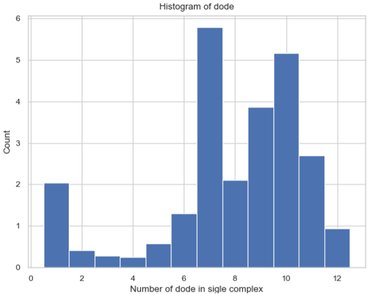

Analyzing Histogram Files
-------------------------

Histogram.dat files are outputs from NERDSS that contain the count of each complex size/type at every time step.

This section includes the initialization functions and methods available in both SingleHistogram and MultiHistogram objects.

*NOTE: All histogram functions are methods of either the SingleHistogram object or the MultiHistogram object. The initialization functions and methods common to both objects are described in the general section.

SingleHistogram Object
~~~~~~~~~~~~~~~~~~~~~~~

SingleHistogram(FileName, FileNum, InitialTime, FinalTime, SpeciesName)

Description:
An object that holds all the data from a single species histogram file, allowing for easy interpretation of the data.

Parameters:

- **FileName** (str): The path to the `.dat` file, typically named `histogram_complexes_time.dat`, representing the histogram data to be analyzed.
    
    - If there are multiple files, they should be named `[name]_1.dat`, `[name]_2.dat`, etc. The `FileName` should be just `[name].dat`.
    
    - Example: `histogram_1.dat`, `histogram_2.dat` ... `FileName = histogram.dat`

- **FileNum** (int): The number of the total input file. If multiple files are provided, their names should follow the naming rule listed above.

- **InitialTime** (float): The initial time in seconds to be examined. Must be smaller than `FinalTime` and greater than the start time in the file.

- **FinalTime** (float): The final time in seconds to be examined. Must be greater than `InitialTime` and smaller than the maximum time in the file.

- **SpeciesName** (str): The name of the species to be examined, which should match the name in the input (`.inp` and `.mol`) files.

Functions:

- All functions in the general / SingleHistogram section are methods of this object.

Returns:

- A new instance of the `SingleHistogram` object.

Example:

.. code-block:: python

    test_histogram = ion.SingleHistogram(FileName = "histogram_single_component.dat", FileNum = 1, InitialTime = 0.0, FinalTime = 1.00, SpeciesName = 'dode')
    >>> Initializes the test_histogram SingleHistogram object for use in all future function

MultiHistogram Object
~~~~~~~~~~~~~~~~~~~~~

MultiHistogram(FileName, FileNum, InitialTime, FinalTime, SpeciesList)

Description:
An object that holds all the data from a multi-species histogram file, allowing for easy interpretation of the data.

Parameters:

- **FileName** (str): The path to the `.dat` file, typically named `histogram_complexes_time.dat`, representing the histogram data to be analyzed.
    
    - If there are multiple files, they should be named `[name]_1.dat`, `[name]_2.dat`, etc. The `FileName` should be just `[name].dat`.
    
    - Example: `histogram_1.dat`, `histogram_2.dat` ... `FileName = histogram.dat`

- **FileNum** (int): The number of the total input file. If multiple files are provided, their names should follow the naming rule listed above.

- **InitialTime** (float): The initial time in seconds to be examined. Must be smaller than `FinalTime` and greater than the start time in the file.

- **FinalTime** (float): The final time in seconds to be examined. Must be greater than `InitialTime` and smaller than the maximum time in the file.

- **SpeciesList** (list): The names of the species in the multi-histogram file, which should match the names in the input (`.inp` and `.mol`) files.

Functions:

- All functions in the general / MultiHistogram section are methods of this object.

Returns:

- A new instance of the `MultiHistogram` object.

Example:

.. code-block:: python

    test_histogram = ion.MultiHistogram(FileName = "histogram_multi_component.dat", FileNum = 1, InitialTime = 0.0, FinalTime = 1.00, SpeciesList = ['A', 'B'])
    >>> Initializes the test_histogram MultiHistogram object for use in all future functions

Converting Histogram Data to DataFrame
~~~~~~~~~~~~~~~~~~~~~~~~~~~~~~~~~~~~~~~

SingleHistogram.hist_to_df(FileNum, SaveCsv)

MultiHistogram.hist_to_df(FileNum, SaveCsv)

Description:
This function converts the raw `.dat` file to a pandas DataFrame for easier analysis. Each column in the DataFrame represents the simulation time and the occurrences of species during the simulation, while each row corresponds to a different simulation time.

Parameters:

- **FileNum** (int): The number of the total input file. If multiple files are provided, their names should follow the naming rule listed above.

- **SaveCsv** (bool, optional): Whether to save the DataFrame as a `.csv` file. Default is `True`.

- **OpName** (str, optional): The name of the output `.csv` file. Default is `"histogram"`. This parameter is irrelevant if `SaveCsv` is `False`.

Returns:

- **hist_dataframe**: A pandas DataFrame that holds the count of each complex at each timestep.

Example:

.. code-block:: python

    hist_dataframe = test_histogram.hist_to_df(FileNum = -1, SaveCsv = False)
    >>> hist_dataframe
    Time(s)  A: 1  A: 1  B: 1  A: 1  B: 2  A: 1  B: 3  A: 1  B: 4  ...  B: 2  B: 3  B: 4  B: 5  B: 6
    0       0.000   100     0     0     0     0     0     0     0  ...     0     0     0     0     0
    1       0.001    86     4     1     0     0     0     4     0  ...     0     0     0     0     0
    2       0.002    76     3     1     1     0     5     0     0  ...     0     0     0     0     0

Converting Histogram Data to CSV
~~~~~~~~~~~~~~~~~~~~~~~~~~~~~~~~

SingleHistogram.hist_to_csv(FileNum, OpName="histogram")

MultiHistogram.hist_to_csv(FileNum, OpName="histogram")

Description:
This function converts the raw `.dat` file to a `.csv` file for easier analysis. Each column in the CSV file represents the simulation time and the occurrences of species during the simulation, while each row corresponds to a different simulation time. If multiple histograms are provided, it will calculate the average between them.

Parameters:

- **FileNum** (int): The number of the total input file. If multiple files are provided, their names should follow the naming rule listed above.

- **OpName** (str, optional): The name of the output `.csv` file. Default is `"histogram"`.

Returns:

- A `.csv` file that holds the count of each complex at each timestep.

Example:

.. code-block:: python

    test_histogram.hist_to_csv(FileNum=1, OpName="histogram")
    >>> Converts the histogram data to a CSV file named "histogram.csv"

.. figure:: ./fig/ionerdss_analyze_hist_csv.png
    :alt: CSV output of the histogram data
    :align: center
    :width: 100%

    The CSV output of the histogram data.

Line Graph – Maximum Count of Protein Species in a Single Complex Over Time
~~~~~~~~~~~~~~~~~~~~~~~~~~~~~~~~~~~~~~~~~~~~~~~~~~~~~~~~~~~~~~~~~~~~~~~~~~~

SingleHistogram.line_max_complex_size(SpeciesName=None, ExcludeSize=0, ShowFig=True, SaveFig=False, SaveVars=False)

MultiHistogram.line_max_complex_size(SpeciesName, ExcludeSize=0, ShowFig=True, SaveFig=False, SaveVars=False)

Description:
Creates a plot showing the maximum number of a specific protein species in a single complex molecule over time. The X-axis represents time, and the Y-axis represents the largest number of the tracked protein in a single complex.

Parameters:

- **SpeciesName** (str, optional): The protein species to be tracked. Required for multi-histogram files. If 'tot' is entered, all species will be included. Default is `None` for single histograms.

- **ExcludeSize** (int, optional): Complexes with a size smaller than or equal to this number will be excluded. Default is `0`.

- **ShowFig** (bool, optional): Whether to display the plot. Default is `True`.

- **SaveFig** (bool, optional): Whether to save the plot as a `.png` file. Default is `False`.

- **SaveVars** (bool, optional): Whether to save the values in text or `.csv` files. The files will be saved in a folder called `vars`. Default is `False`.

Returns:

- **time_stamps**: The time stamps included in the line graph.

- **max_cmplx_size**: A list of the maximum complex sizes at each time stamp.

- **std**: The standard deviation of each maximum complex size.

Example:

.. code-block:: python

    # For SingleHistogram
    time_stamps, max_cmplx_size, std = test_histogram.line_max_complex_size(ShowFig=True, SaveFig=False, SaveVars=False)
    
    # For MultiHistogram
    time_stamps, max_cmplx_size, std = test_histogram.line_max_complex_size(SpeciesName='A', ShowFig=True, SaveFig=False, SaveVars=False)

    Line graph of the maximum count of protein species in a single-species complex over time.

    Line graph of the maximum count of protein species in a multi-species complex over time.

Line Graph – Mean Count of Protein Species in a Single Complex Over Time
~~~~~~~~~~~~~~~~~~~~~~~~~~~~~~~~~~~~~~~~~~~~~~~~~~~~~~~~~~~~~~~~~~~~~~~~

SingleHistogram.line_mean_complex_size(SpeciesName=None, ExcludeSize=0, ShowFig=True, SaveFig=False, SaveVars=False)

MultiHistogram.line_mean_complex_size(SpeciesName, ExcludeSize=0, ShowFig=True, SaveFig=False, SaveVars=False)

Description:
Creates a plot showing the mean number of a specific protein species in a single complex molecule over time. The X-axis represents time, and the Y-axis represents the average number of the tracked protein in a single complex.

Parameters:

- **SpeciesName** (str, optional): The protein species to be tracked. Required for multi-histogram files. If 'tot' is entered, all species will be included. Default is `None` for single histograms.

- **ExcludeSize** (int, optional): Complexes with a size smaller than or equal to this number will be excluded. Default is `0`.

- **ShowFig** (bool, optional): Whether to display the plot. Default is `True`.

- **SaveFig** (bool, optional): Whether to save the plot as a `.png` file. Default is `False`.

- **SaveVars** (bool, optional): Whether to save the values in text or `.csv` files. The files will be saved in a folder called `vars`. Default is `False`.

Returns:

- **time_stamps**: The time stamps included in the line graph.

- **mean_cmplx_size**: A list of the mean complex sizes at each time stamp.

- **std**: The standard deviation of each mean complex size.

Example:

.. code-block:: python

    # For SingleHistogram
    time_stamps, mean_cmplx_size, std = test_histogram.line_mean_complex_size(ShowFig=True, SaveFig=False, SaveVars=False)
    
    # For MultiHistogram
    time_stamps, mean_cmplx_size, std = test_histogram.line_mean_complex_size(SpeciesName='A', ShowFig=True, SaveFig=False, SaveVars=False)

    Line graph of the average count of protein species in a single-species complex over time.

.. figure:: ./fig/ionerdss_analyze_hist_mean_multi.png
    :alt: Line graph of the average count of protein species in a multi-species complex over time
    :align: center
    :width: 100%

    Line graph of the average count of protein species in a multi-species complex over time.

Histogram – Average Number of Each Complex Species Size
~~~~~~~~~~~~~~~~~~~~~~~~~~~~~~~~~~~~~~~~~~~~~~~~~~~~~~~

SingleHistogram.hist_complex_count(BarSize=1, ShowFig=True, SaveFig=False, SaveVars=False)

Description:
Creates a histogram of the average number of each type/size of complex species. The X-axis represents each complex species type (each size), and the Y-axis represents the average count over a time frame (initial to final). If a single file is provided, the input file should be named as its original name (`histogram_complexes_time.dat`); if multiple files are provided, the name of the input file should also include a serial number as `histogram_complexes_time_X.dat` where X = 1, 2, 3, 4, 5...

Parameters:

- **BarSize** (int, optional): The size of each data bar in the x-dimension. The x-axis will be separated evenly according to this number, and the count of each size range will be summed up and shown together. Default is `1`.

- **ShowFig** (bool, optional): Whether to display the plot. Default is `True`.

- **SaveFig** (bool, optional): Whether to save the plot as a `.png` file. Default is `False`.

- **SaveVars** (bool, optional): Whether to save the values in text or `.csv` files. The files will be saved in a folder called `vars`. Default is `False`.

Returns:

- **cmplx_sizes**: Each complex size.

- **cmplx_count**: The average count of each complex size.

- **std**: The standard deviation of each complex count.

Example:

.. code-block:: python

    cmplx_sizes, cmplx_count, std = test_histogram.hist_complex_count(BarSize=1, ShowFig=True, SaveFig=False, SaveVars=False)
    

    Histogram of the average number of each complex species size.

3D Histogram – Relative Occurrence of Each Species Over Time
~~~~~~~~~~~~~~~~~~~~~~~~~~~~~~~~~~~~~~~~~~~~~~~~~~~~~~~~~~~~

SingleHistogram.hist_3d_complex_count(TimeBins, xBarSize=1, ShowFig=True, SaveFig=False, SaveVars=False)

Description:
Generates a 3D histogram representing the number of monomers in a single complex as simulation time progresses. The x-axis represents the number of monomers, the y-axis represents the averaged time, and the z-axis represents the relative occurrence probabilities.

Parameters:

- **TimeBins** (int): The number of bins to divide the selected time into. Must be a positive integer.

- **xBarSize** (int, optional): The size of each data bar in the x-dimension. The x-axis will be divided evenly according to this number, and the count of each size range will be summed and displayed together. Default is `1`.

- **ShowFig** (bool, optional): Whether to display the plot. Default is `True`.

- **SaveFig** (bool, optional): Whether to save the plot as a `.png` file. Default is `False`.

- **SaveVars** (bool, optional): Whether to save the values in text or `.csv` files. The files will be saved in a folder called `vars`. Default is `False`.

Returns:

- **cmplx_sizes**: Each complex size.

- **time_bins**: Each time bin included.

- **cmplx_count**: The average count of each complex size.

Example:

.. code-block:: python

    cmplx_sizes, time_bins, cmplx_count, std = test_histogram.hist_3d_complex_count(TimeBins=10, xBarSize=1, ShowFig=True, SaveFig=False, SaveVars=False)

    Histogram of the average number of each complex species size over time.

Heatmap – Average Number of Complexes at Each Time Interval
~~~~~~~~~~~~~~~~~~~~~~~~~~~~~~~~~~~~~~~~~~~~~~~~~~~~~~~~~~~

SingleHistogram.heatmap_complex_count(TimeBins, xBarSize=1, ShowFig=True, ShowMean=False, ShowStd=False, SaveFig=False, SaveVars=False)

Description:
Generates a 2D heatmap showing the distribution of different N-mers over time. The x-axis represents the number of monomers in a single complex, the y-axis represents time, and the color in each box indicates the number of corresponding N-mers at each time interval.

Parameters:

- **TimeBins** (int): The number of bins to divide the selected time into. Must be a positive integer.

- **xBarSize** (int, optional): The size of each data bar in the x-dimension. The x-axis will be divided evenly according to this number, and the count of each size range will be summed and displayed together. Default is `1`.

- **ShowFig** (bool, optional): Whether to display the plot. Default is `True`.

- **ShowMean** (bool, optional): Whether to display the mean value in the center of each box. Default is `False`.

- **ShowStd** (bool, optional): Whether to display the standard deviation value in the center of each box. Default is `False`.

- **SaveFig** (bool, optional): Whether to save the plot as a `.png` file. Default is `False`.

- **SaveVars** (bool, optional): Whether to save the values in text or `.csv` files. The files will be saved in a folder called `vars`. Default is `False`.

Returns:

- **cmplx_sizes**: Each complex size.

- **time_bins**: Each time bin included.

- **cmplx_count**: The average count of each complex size.

- **std**: The standard deviation of each complex count.

Example:

.. code-block:: python

    time_stamps, time_bins, mean_cmplx_size, std = test_histogram.heatmap_complex_count(TimeBins=10, xBarSize=1, ShowFig=True, SaveFig=False, ShowMean=False, ShowStd=False, SaveVars=False)

    Heatmap of the average number of each complex species size over time.

Heatmap – Total Count of Monomers in Each Complex Size vs. Time
~~~~~~~~~~~~~~~~~~~~~~~~~~~~~~~~~~~~~~~~~~~~~~~~~~~~~~~~~~~~~~~

SingleHistogram.heatmap_monomer_count(TimeBins, xBarSize=1, ShowFig=True, ShowMean=False, ShowStd=False, SaveFig=False, SaveVars=False)

Description:
Generates a 2D heatmap showing the total count of monomers in different N-mers over time. The x-axis represents the number of monomers in a single complex, the y-axis represents time, and the color in each box indicates the total number of corresponding monomers in N-mers at each time interval.

Parameters:

- **TimeBins** (int): The number of bins to divide the selected time into. Must be a positive integer.

- **xBarSize** (int, optional): The size of each data bar in the x-dimension. The x-axis will be divided evenly according to this number, and the count of each size range will be summed and displayed together. Default is `1`.

- **ShowFig** (bool, optional): Whether to display the plot. Default is `True`.

- **ShowMean** (bool, optional): Whether to display the mean value in the center of each box. Default is `False`.

- **ShowStd** (bool, optional): Whether to display the standard deviation value in the center of each box. Default is `False`.

- **SaveFig** (bool, optional): Whether to save the plot as a `.png` file. Default is `False`.

- **SaveVars** (bool, optional): Whether to save the values in text or `.csv` files. The files will be saved in a folder called `vars`. Default is `False`.

Returns:

- **cmplx_sizes**: Each complex size.

- **time_bins**: Each time bin included.

- **mono_count**: The number of monomers in each complex.

- **std**: The standard deviation of each complex count.

Example:

.. code-block:: python

    cmplx_sizes, time_bins, mono_count, std = test_histogram.heatmap_monomer_count(TimeBins=10, xBarSize=1, ShowFig=True, SaveFig=False, ShowMean=False, ShowStd=False, SaveVars=False)

    Heatmap of the total count of monomers in each complex size over time.

Heatmap – Fractions of Original Monomers in Each Complex Species vs. Time
~~~~~~~~~~~~~~~~~~~~~~~~~~~~~~~~~~~~~~~~~~~~~~~~~~~~~~~~~~~~~~~~~~~~~~~~~

SingleHistogram.heatmap_monomer_fraction(TimeBins, xBarSize=1, ShowFig=True, ShowMean=False, ShowStd=False, SaveFig=False, SaveVars=False)

Description:
Generates a 2D heatmap showing the fraction of original monomers in different complex species over time. The x-axis represents the number of monomers in a single complex, the y-axis represents time, and the color in each box indicates the fraction of monomers forming the corresponding N-mers at each time interval.

Parameters:

- **TimeBins** (int): The number of bins to divide the selected time into. Must be a positive integer.

- **xBarSize** (int, optional): The size of each data bar in the x-dimension. The x-axis will be divided evenly according to this number, and the count of each size range will be summed and displayed together. Default is `1`.

- **ShowFig** (bool, optional): Whether to display the plot. Default is `True`.

- **ShowMean** (bool, optional): Whether to display the mean value in the center of each box. Default is `False`.

- **ShowStd** (bool, optional): Whether to display the standard deviation value in the center of each box. Default is `False`.

- **SaveFig** (bool, optional): Whether to save the plot as a `.png` file. Default is `False`.

- **SaveVars** (bool, optional): Whether to save the values in text or `.csv` files. The files will be saved in a folder called `vars`. Default is `False`.

Returns:

- **cmplx_sizes**: Each complex size.

- **time_bins**: Each time bin included.

- **mono_fractions**: The fraction of monomers in each complex.

- **std**: The standard deviation of each complex count.

Example:

.. code-block:: python

    cmplx_sizes, time_bins, mono_fractions, std = test_histogram.heatmap_monomer_fraction(TimeBins=10, xBarSize=1, ShowFig=True, SaveFig=False, ShowMean=False, ShowStd=False, SaveVars=False)

    Heatmap of the fraction of original monomers in each complex species over time.

Histogram – Frequency of Each Complex Size
~~~~~~~~~~~~~~~~~~~~~~~~~~~~~~~~~~~~~~~~~~

MultiHistogram.hist_complex_count(BinNums=10, ExcludeSize=0, ShowFig=True, SaveFig=False, SaveVars=False)

Description:
This function generates a histogram showing the frequency of each complex size in a multi-species system. It can analyze multiple input files and display the results with error bars. The x-axis represents the size of the selected species or the total number of monomers, and the y-axis represents the average count for each corresponding size.

Parameters:

- **BinNums** (int, optional): The number of bins in the histogram. Default is `10`.

- **ExcludeSize** (int, optional): Complexes with a size smaller than or equal to this number will be excluded from the average calculation. Default is `0`.

- **ShowFig** (bool, optional): Whether to display the plot. Default is `True`.

- **SaveFig** (bool, optional): Whether to save the plot as a `.png` file. Default is `False`.

- **SaveVars** (bool, optional): Whether to save the values in text or `.csv` files. The files will be saved in a folder called `vars`. Default is `False`.

Returns:

- **cmplx_sizes**: Each complex size.

- **cmplx_count**: The frequency of each complex size.

- **std**: The standard deviation of each complex count.

Example:

.. code-block:: python

    cmplx_sizes, cmplx_count, std = test_histogram.hist_complex_count(BinNums=10, ShowFig=True, SaveFig=False, SaveVars=False)
    

    Histogram of the frequency of each complex size.

Stacked Histogram – Counts of Complex Species with Certain Protein Compositions
~~~~~~~~~~~~~~~~~~~~~~~~~~~~~~~~~~~~~~~~~~~~~~~~~~~~~~~~~~~~~~~~~~~~~~~~~~~~~~~

MultiHistogram.stack_hist_complex_count(xAxis, DivideSpecies, DivideSize, BarSize=1, ExcludeSize=0, ShowFig=True, SaveFig=False, SaveVars=False)

Description:
This function generates a stacked histogram showing the total size of complexes or selected species for a multi-species system. Each bar is split into three stacked sections representing the size distribution of another selected species. It can analyze multiple input files and display the results with error bars. The x-axis represents the size of the selected species or the total number of monomers, and the y-axis represents the average count for each corresponding size.

Parameters:

- **xAxis** (str): Indicates the species shown on the x-axis. Either input a species name to show the number of selected components, or input 'tot' to count all species in a single complex.

- **DivideSpecies** (str): The name of the species to be separated by size.

- **DivideSize** (int): The value that separates the size of the dissociate complex. For example, if `DivideSize = 5`, the dissociate events are classified as 'DivideSpecies size < 5', 'DivideSpecies size = 5', and 'DivideSpecies size > 5'.

- **BarSize** (int, optional): The size of each data bar in the x-dimension. The x-axis will be divided evenly according to this number, and the count of each size range will be summed and displayed together. Default is `1`.

- **ExcludeSize** (int, optional): Complexes with a size smaller than or equal to this number will be excluded from the average calculation. Default is `0`.

- **ShowFig** (bool, optional): Whether to display the plot. Default is `True`.

- **SaveFig** (bool, optional): Whether to save the plot as a `.png` file. Default is `False`.

- **SaveVars** (bool, optional): Whether to save the values in text or `.csv` files. The files will be saved in a folder called `vars`. Default is `False`.

Returns:

- **x_mono_count**: The count of the x monomer in a complex.

- **cmplx_count**: The frequency of each complex. List1 = below division, List2 = equal division, List3 = above division.

- **std**: The standard deviation of each complex count.

Example:

.. code-block:: python

    x_mono_count, cmplx_count, std = test_histogram.stack_hist_complex_count(xAxis="A", DivideSpecies="B", DivideSize=5, BarSize=1, ShowFig=True, SaveFig=False, SaveVars=False)

    Stacked histogram of the counts of complex species with certain protein compositions.

Heatmap – Average Count of Each Complex Composition Over Simulation Time
~~~~~~~~~~~~~~~~~~~~~~~~~~~~~~~~~~~~~~~~~~~~~~~~~~~~~~~~~~~~~~~~~~~~~~~~

MultiHistogram.heatmap_complex_dist(xAxis, yAxis, xBarSize=1, yBarSize=1, ShowFig=True, ShowMean=False, ShowStd=False, SaveFig=False, SaveVars=False)

Description:
Generates a heatmap representing the distribution of the size of selected species over a certain time frame. The x and y axes represent the desired individual components, and the color of each square indicates the relative occurrence probability of complexes of the corresponding size.

Parameters:

- **xAxis** (str): Indicates the species shown on the x-axis. If `xAxis` is included in `SpeciesList`, the x-axis will only show the number of selected components.

- **yAxis** (str): Indicates the species shown on the y-axis. If `yAxis` is included in `SpeciesList`, the y-axis will only show the number of selected components.

- **xBarSize** (int, optional): The size of each data bar in the x-dimension. The x-axis will be divided evenly according to this number, and the count of each size range will be summed and displayed together. Default is `1`.

- **yBarSize** (int, optional): The size of each data bar in the y-dimension. The y-axis will be divided evenly according to this number, and the count of each size range will be summed and displayed together. Default is `1`.

- **ShowFig** (bool, optional): Whether to display the plot. Default is `True`.

- **ShowMean** (bool, optional): Whether to display the mean value in the center of each box. Default is `False`.

- **ShowStd** (bool, optional): Whether to display the standard deviation value in the center of each box. Default is `False`.

- **SaveFig** (bool, optional): Whether to save the plot as a `.png` file. Default is `False`.

- **SaveVars** (bool, optional): Whether to save the values in text or `.csv` files. The files will be saved in a folder called `vars`. Default is `False`.

Returns:

- **x_mono_count**: The count of the x monomer in a complex.

- **y_mono_count**: The count of the y monomer in a complex.

- **cmplx_count**: The frequency of each complex.

- **std**: The standard deviation of each complex count.

Example:

.. code-block:: python

    x_mono_count, y_mono_count, cmplx_count, std = test_histogram.heatmap_complex_dist(xAxis='A', yAxis='B', xBarSize=1, yBarSize=1, ShowFig=True, ShowMean=False, ShowStd=False, SaveFig=False, SaveVars=False)

    Heatmap of the average count of each complex composition over simulation time.

3D Histogram – Average Count of Each Complex Composition Over Simulation Time
~~~~~~~~~~~~~~~~~~~~~~~~~~~~~~~~~~~~~~~~~~~~~~~~~~~~~~~~~~~~~~~~~~~~~~~~~~~~~

MultiHistogram.hist_3D_complex_dist(xAxis, yAxis, xBarSize=1, yBarSize=1, ShowFig=True, SaveFig=False, SaveVars=False)

Description:
Generates a 3D histogram representing the distribution of the size of selected species over a certain time frame. The x and y axes represent the desired individual components, and the height of each column represents the relative occurrence probability of complexes of the corresponding size.

Parameters:

- **xAxis** (str): Indicates the species shown on the x-axis. If `xAxis` is included in `SpeciesList`, the x-axis will only show the number of selected components.

- **yAxis** (str): Indicates the species shown on the y-axis. If `yAxis` is included in `SpeciesList`, the y-axis will only show the number of selected components.

- **xBarSize** (int, optional): The size of each data bar in the x-dimension. The x-axis will be divided evenly according to this number, and the count of each size range will be summed and displayed together. Default is `1`.

- **yBarSize** (int, optional): The size of each data bar in the y-dimension. The y-axis will be divided evenly according to this number, and the count of each size range will be summed and displayed together. Default is `1`.

- **ShowFig** (bool, optional): Whether to display the plot. Default is `True`.

- **SaveFig** (bool, optional): Whether to save the plot as a `.png` file. Default is `False`.

- **SaveVars** (bool, optional): Whether to save the values in text or `.csv` files. The files will be saved in a folder called `vars`. Default is `False`.

Returns:

- **x_mono_count**: The count of the x monomer in a complex.

- **y_mono_count**: The count of the y monomer in a complex.

- **cmplx_count**: The frequency of each complex.

Example:

.. code-block:: python

    x_mono_count, y_mono_count, cmplx_count = test_histogram.hist_3D_complex_dist(xAxis='A', yAxis='B', xBarSize=1, yBarSize=1, ShowFig=True, SaveFig=False, SaveVars=False)

    Histogram of the average count of each complex composition over simulation time.

Line Graph – Fraction of Monomers Assembled Over Time
~~~~~~~~~~~~~~~~~~~~~~~~~~~~~~~~~~~~~~~~~~~~~~~~~~~~~

SingleHistogram.frac_of_assemble(Mol, Threshold=2, ShowFig=True, SaveFig=False, SaveVars=False)

Description:
Determines the fraction of monomers in a complex of a certain size at each time stamp.

Parameters:

- **Mol** (str): The molecule to be shown.

- **Threshold** (int, optional): The minimum size to be considered assembled. Default is `2`.

- **ShowFig** (bool, optional): Whether to display the plot. Default is `True`.

- **SaveFig** (bool, optional): Whether to save the plot as a `.png` file. Default is `False`.

- **SaveVars** (bool, optional): Whether to save the values in text or `.csv` files. The files will be saved in a folder called `vars`. Default is `False`.

Returns:

- **time_bins**: Each time bin included.

- **frac_assembled_monos**: The percentage of monomers in a complex greater than the threshold.

- **std**: The standard deviation of each fraction of assembled monomers.

Example:

.. code-block:: python

    time_bins, frac_assembled_monos, std = test_histogram.frac_of_assemble(Mol="B", Threshold=2, ShowFig=True, SaveFig=False, SaveVars=False)

    Line graph of the fraction of monomers assembled over time.
