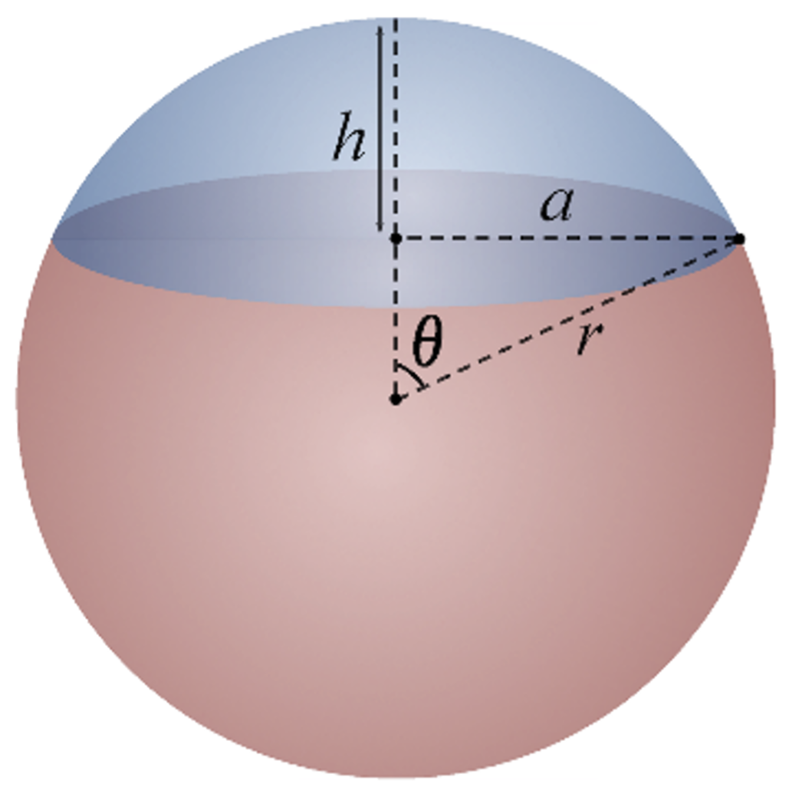
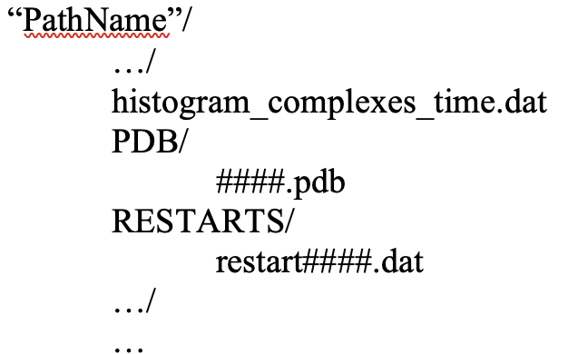

Sphere Regularization Index
~~~~~~~~~~~~~~~~~~~~~~~~~~~

sphere_regularization_index(PathName, IterNum, TimeStep, ComplexNum, SpeciesName)

**Description:** 
Calculates the sphere regularization index of a complex yielded from NERDSS.

**Important Note:**

    Sphere regularization index of a Gag complex.

In the sphere assembled by gag proteins, each gag monomer can be viewed as a sphere cap contributing a portion of the sphere. Ideally, the gag monomers would self-organize themselves exactly on the surface of the ideal sphere and become “spherical caps” that perfectly comprise of the sphere. However, this assembly may not be perfect in real life. The theta of each gag sphere cap can be either greater than or less than the ideal theta of the sphere. In this case, the sphere regularization index is calculated as the ratio of gag monomers that have their theta less than or equal to the ideal theta in an assembled complex. This function calculated the regularization index of the complexes formed in the simulation.
The function calculates the sphere regularization index of the first, second, and third largest gag complex at iteration 200000. It requires the histogram_complexes_time.dat, restart####.dat, ####.pdb from the NERDSS simulation in this arrangement (#### being the iteration number). The regularization index is calculated as the ratio of gag monomers that have their cap theta less than or equal to the ideal theta of the gag sphere in an assembled complex.

    Folder structure for sphere regularization index calculation.

Which is the default arrangement NERDSS output after a simulation is run.

**Parameters:**

- **PathName** (*str*): 
    The path of the histogram file, PDB, and restart file.

- **IterNum** (*int*): 
    The iteration number of the simulation intended to be evaluated.

- **TimeStep** (*float*): 
    The time step of the NERDSS simulation, in microseconds.

- **ComplexNum** (*int*): 
    The number of complexes to be analyzed, starting from the largest complex size.

- **SpeciesName** (*str*, optional, default="gag"): 
    The name of the species to be analyzed.

**Returns:**

- **max_complex_size_return** (*list*): 
    The complex size of each complex evaluated (1 indicates monomer, etc).

- **theta_ideal_return** (*list*): 
    The ideal spherical angle of each complex.

- **sphere_radius_return** (*list*): 
    The sphere radius of each complex.

- **complex_COM_return** (*list*): 
    The center of mass of each complex.

- **regularization_index_return** (*list*): 
    The regularization index of each complex.

**Example:**

.. code-block:: python

    import ionerdss as ion
    max_complex_size, theta_ideal, sphere_radius, complex_COM, regularization_index = ion.sphere_regularization_index(PathName = “gagsphere”, IterNum = 200000, TimeStep = 0.1, ComplexNum = 3, SpeciesName = “gag”)
