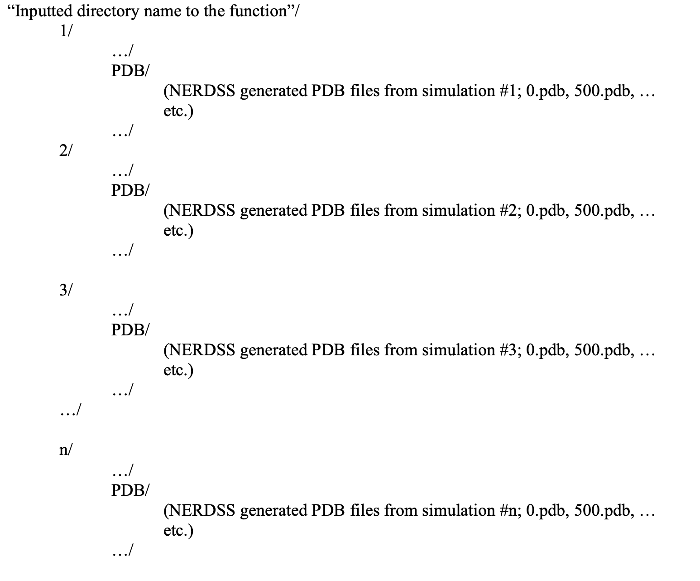
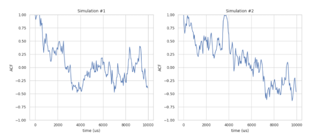
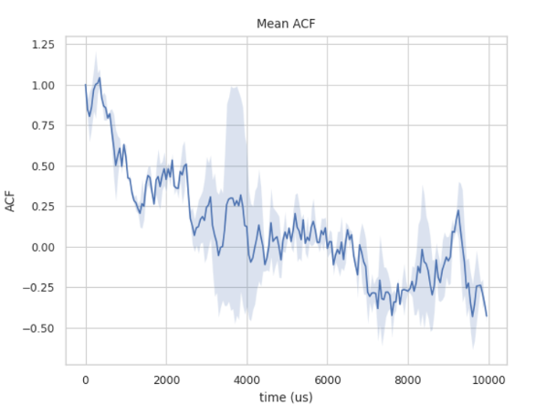

Locating position for certain size of complexes by PDB/restart file
-------------------------------------------------------------------

By PDB file
~~~~~~~~~~~

locate_pos_no_restart(FileNamePdb, NumDict, FileNameInp, BufferRatio=0.01, OpName="output_file")

Description:
This function allows users to locate specific complexes of a certain size from a PDB file after simulation. The result is output as a new file named `output_file.pdb` containing only the desired complex.

Parameters:

- **FileNamePdb** (*str*): The path to the PDB file, typically the last frame of the simulation.

- **NumDict** (*dict*): A dictionary that holds the requested number of protein types in a complex.

- **FileNameInp** (*str*): The path to the `.inp` file, which usually stores the reaction information.

- **BufferRatio** (*float*, optional, default=0.01): The buffer ratio used to determine whether two reaction interfaces can be considered bonded.

- **OpName** (*str*, optional, default="output_file"): The name of the output file.

Returns:

- **.pdb file**: A PDB file containing only the selected complexes.

Example:

.. code-block:: python

    import ionerdss as ion
    ion.locate_pos_no_restart(FileNamePdb = "nerdss_output.pdb", NumDict={"dod":9}, FileNameInp="parm.inp", OpName = “output”)
    >>> Output_file.pdb that includes only proteins in complexes of the selected size  
    ...
    ATOM     19  COM dod    3      301.720 116.470 306.361     0     0CL
    ATOM     20  lg1 dod    3      315.636 126.000 315.231     0     0CL
    ATOM     21  lg2 dod    3      312.386 125.024 293.086     0     0CL
    ....

By restart.dat file
~~~~~~~~~~~~~~~~~~~

locate_pos_restart(FileNamePdb, NumDict, FileNameRestart, OpName="output_file")

Description:
This function enables users to locate specific complexes of a certain size from a PDB file along with a `restart.dat` file after simulation. The result is output as a new file named `output_file.pdb` containing only the desired complex.

Important Note:
The advantage of reading the `restart.dat` file is that it directly stores the binding information of each complex in the system, allowing the function to run faster. However, this function is not universal; if the write logic of the `restart.dat` file changes, the function will no longer work.

Parameters:

- **FileNamePdb** (*str*): The path to the PDB file, typically the last frame of the simulation.

- **NumDict** (*dict*): A dictionary that holds the requested number of protein types in a complex.

- **FileNameRestart** (*str*): The path to the `restart.dat` file.

- **OpName** (*str*, optional, default="output_file"): The name of the output file.

Returns:

- **.pdb file**: A PDB file containing only the selected complexes.

Example:

.. code-block:: python

    import ionerdss as ion
    ion.locate_pos_restart(FileNamePdb="nerdss_output.pdb", NumDict={"dod": 9}, FileNameRestart="restart.dat", OpName="output")
    >>> Output_file.pdb that includes only proteins in complexes of the selected size
    ...
    ATOM     19  COM dod    3      301.720 116.470 306.361     0     0CL
    ATOM     20  lg1 dod    3      315.636 126.000 315.231     0     0CL
    ATOM     21  lg2 dod    3      312.386 125.024 293.086     0     0CL
    ATOM     22  lg3 dod    3      294.395 112.226 289.287     0     0CL
    ....

Analyzing .xyz files
~~~~~~~~~~~~~~~~~~~~

.xyz files hold the location of every protein at specific times. (Does not necessarily include every timestamp, more to compare a couple of timestamps).

CSV – creates spreadsheet of protein locations
^^^^^^^^^^^^^^^^^^^^^^^^^^^^^^^^^^^^^^^^^^^^^^

xyz_to_csv(FileName, LitNum, OpName="output_file")

Description:
This function converts the output `.xyz` file from a NERDSS simulation into a `.csv` file for a specific or entire time frame. The generated `.csv` file will contain 5 columns: iteration number, species name, and x, y, z coordinates.

Parameters:

- **FileName** (*str*): The path to the `.xyz` file, typically named `trajectory.xyz`.

- **LitNum** (*int*, optional, default=-1): The iteration number to examine. If set to -1, the function will extract data for all iterations.

- **OpName** (*str*, optional, default="output_file"): The name of the output file.

Returns:

- **.csv file**: A CSV file containing the specified trajectory data.

Example:

.. code-block:: python

    import ionerdss as ion
    ion.xyz_to_csv(FileName="trajectory.xyz", LitNum=-1)
    >>> output_file.csv containing the trajectory data

DATAFRAME – creates dataframe of protein locations
^^^^^^^^^^^^^^^^^^^^^^^^^^^^^^^^^^^^^^^^^^^^^^^^^^

xyz_to_df(FileName, LitNum=-1, SaveCsv=True):

Description:
This function converts the output `.xyz` file from a NERDSS simulation into a `pandas.DataFrame` for a specific or entire time frame. The generated DataFrame will contain 5 columns: iteration number, species name, and x, y, z coordinates. Optionally, the DataFrame can be saved as a `.csv` file.

Parameters:

- **FileName** (*str*): The path to the `.xyz` file, typically named `trajectory.xyz`.

- **LitNum** (*int*, optional, default=-1): The iteration number to examine. If set to -1, the function will extract data for all iterations.

- **SaveCsv** (*bool*, optional, default=True): Whether to save the DataFrame as a `.csv` file.

Returns:

- **pandas.DataFrame**: A DataFrame containing the specified trajectory data.

Example:

.. code-block:: python

    import ionerdss as ion
    traj_df = ion.xyz_to_df(FileName="trajectory.xyz", LitNum=-1, SaveCsv=False)
    >>> traj_df
       iteration name           x           y           z
    0          0   ap   87.420620 -270.109172 -203.661987
    1          0   ap   88.081526 -271.052470 -205.297038
    2          0   ap   86.759715 -269.165874 -202.026936
    3          0   ap  -58.647113  277.528515 -353.236112
    ...

MATRIX - tracks the trajectory of specific protein(s)
^^^^^^^^^^^^^^^^^^^^^^^^^^^^^^^^^^^^^^^^^^^^^^^^^^^^^

traj_track(FileName, SiteNum, MolIndex, SaveVars=False)

Description:
This function enables users to track the center of mass (COM) coordinates of one or more molecules over time. The return will be a 2D matrix with the size of the number of iterations times the number of desired molecules.

Parameters:

- **FileName** (*str*): The path to the `.xyz` file, typically named `trajectory.xyz`.

- **SiteNum** (*int*): The total number of COM and interfaces of a single molecule. For example, if a molecule possesses 1 COM and 5 interfaces, the `SiteNum` value should be 6.

- **MolIndex** (*list of int*): The indices of the molecules to track. The numbers in the list should be no smaller than 1.

- **SaveVars** (*bool*, optional, default=False): Whether to save the outputs in a file.

Returns:

- **Trajectory** (*list*): A list containing the COM coordinates of the specified molecules at different time stamps.

Example:

.. code-block:: python

    import ionerdss as ion
    trajectory = ion.traj_track(FileName="trajectory.xyz", SiteNum=3, MolIndex=[1, 4, 10])
    >>> trajectory
    [
        [[87.42062, -270.109172, -203.661987], [40.873538, 168.96348, -497.993163]],
        [[74.407358, 51.461467, -242.958456], [187.824563, 325.913499, -497.993163]],
        [[20.608487, 330.919045, -182.061499], [-27.367719, 330.945162, -497.993163]]
    ]

Analyzing .pdb files
~~~~~~~~~~~~~~~~~~~~

LINE PLOT- Auto correlation function (acf) for complexes
^^^^^^^^^^^^^^^^^^^^^^^^^^^^^^^^^^^^^^^^^^^^^^^^^^^^^^^^

acf_coord(PDBDirectory, mol_list, sim_num=1, time_step=1, show_fig=True, save_fig=False)

Description:
Calculates the mean auto-correlation function (ACF) of protein complexes stored in a series of NERDSS-generated PDB files. If PDB files from multiple simulations are to be evaluated, they should be organized in the following directory structure before running the function:

    Directory structure for ACF analysis.

Important Note:
Given a series of `.pdb` files generated during NERDSS simulation, the function calculates the auto-correlation function (ACF) of the system. The ACF describes the correlation of a signal with a delayed copy of itself as a function of delay. In this context, it is the correlation of a complex’s position with its initial position as a function of time, calculated as the inner product between the initial position vector of a complex and its current position vector divided by the squared magnitude of its initial position vector:
    
.. math::

    \text{acf}(t) = \frac{\mathbf{r}(0) \cdot \mathbf{r}(t)}{\mathbf{r}(0) \cdot \mathbf{r}(0)}

Parameters:

- **PDBDirectory** (*str*): The name of the directory where all PDB files are stored.

- **mol_list** (*list of str*): The names of the molecules to be evaluated.

- **sim_num** (*int*, optional, default=1): The number of repeated simulations to be evaluated.

- **time_step** (*int*, optional, default=1): The time steps of the NERDSS simulation in microseconds.

- **show_fig** (*bool*, optional, default=True): Whether to display the generated plots.

- **save_fig** (*bool*, optional, default=False): Whether to save the generated plots.

Returns:

- **average_time_array** (*array*): An array of iterations when the mean ACF over all repeated simulations is calculated.

- **average_acf_array** (*array*): An array of the mean ACF calculated over all repeated simulations.

- **std_acf_array** (*array*): An array of the standard deviation of the ACF calculated over all repeated simulations.

Example:

.. code-block:: python

    import ionerdss as ion
    ion.acf_coord(PDBDirectory="testing_PDBs", mol_list=["A"], sim_num=2, time_step=0.1, show_fig=True, save_fig=False)

    Separate ACF plots for each simulation.

    Mean ACF plot over all simulations.
