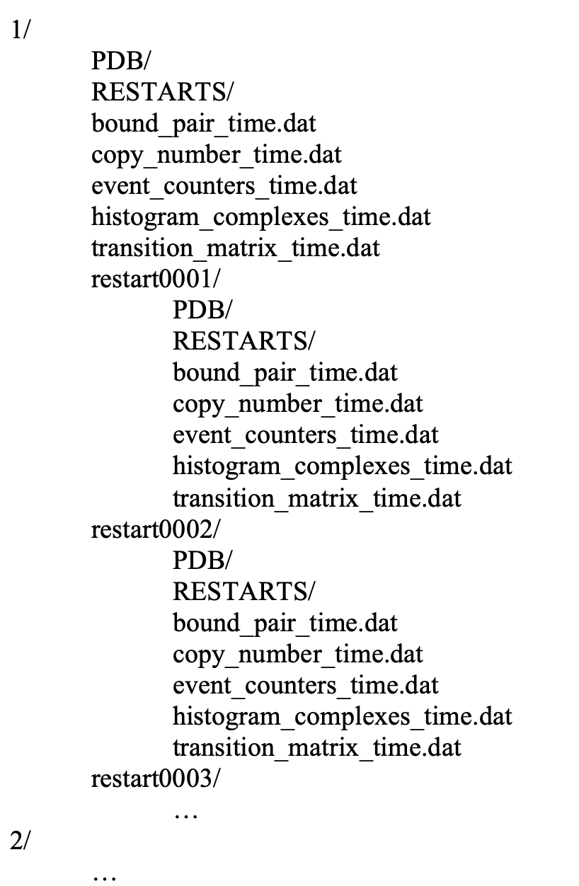

Merging results from restart simulations
~~~~~~~~~~~~~~~~~~~~~~~~~~~~~~~~~~~~~~~~

Merging NERDSS restart simulations output files
^^^^^^^^^^^^^^^^^^^^^^^^^^^^^^^^^^^^^^^^^^^^^^^

merge_simulation_results()

Description:
The output files from multiple simulations and their corresponding restart simulations should be in a structured manner:

    Folder structure for merging results from multiple simulations with restart simulations.

Next, run the function. This function will merge the following files and directories from the original simulation and all its restart simulations: `bound_pair_time.dat`, `copy_number_time.dat`, `event_counters_time.dat`, `histogram_complexes_time.dat`, `transition_matrix_time.dat`, the `PDB` directory, and the `RESTART` directory. After merging, all `restart####` directories will be removed.

.. important::
    Before running the function, ensure the following:
    
    1. Run the function in the directory containing subdirectories named `1/`, `2/`, etc.
    2. Assign names to the `restart####` directories based on the order of their first recorded iterations. For example, if the restart simulation data begins at time=0.5, it should be stored in `restart0001`, and if it begins at time=1.0, it should be stored in `restart0003`.

**Parameters:**
- None

**Returns:**
- None

Merging NERDSS output files
^^^^^^^^^^^^^^^^^^^^^^^^^^^

Description:
Merges NERDSS output files. If the `file_type` parameter is not provided, the function will simply concatenate the `source_file` to the end of the `destination_file`. If a specific `file_type` is provided, the function will correctly retain the iterations in the `destination_file` that occurred before the first recorded iteration in the `source_file` and then concatenate the data from the `source_file` to the end of the retained iterations in the `destination_file`. For example, if the `destination_file` contains iterations from time=0.0 to time=1.0, and the `source_file` contains iterations from time=0.5 to time=100.0, the function will keep the iterations from time=0.0 to the last iteration before time=0.5 in the `destination_file` and concatenate iterations from time=0.5 to time=100.0 from the `source_file` to the `destination_file`.

Parameters:

- `destination_file` (str): The path of the destination file.

- `source_file` (str): The path of the source file.

- `file_type` (str): The file type of the files to be merged. Options include:

    - "histogram" (histogram_complexes_time.dat)

    - "event" (event_counters_time.dat)

    - "bound" (bound_pair_time.dat)

    - "copy" (copy_number_time.dat)

    - "transition" (transition_matrix_time.dat)

Returns:

- None

