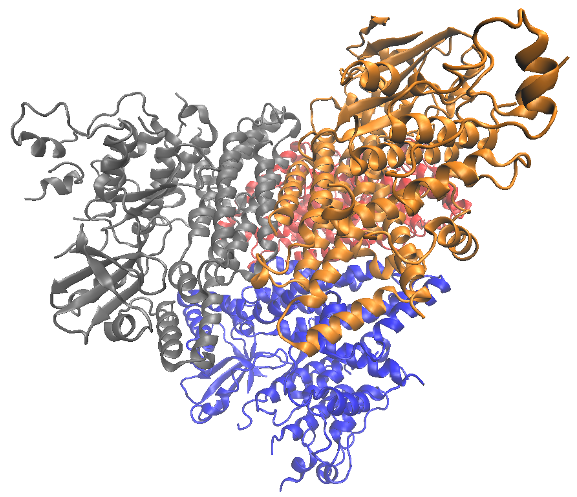
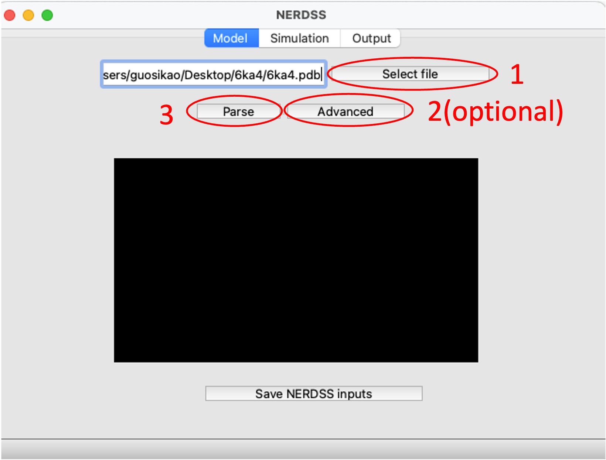
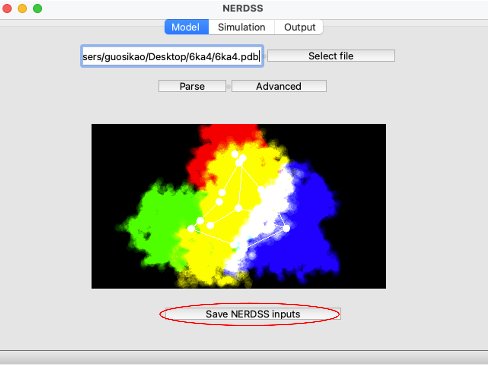
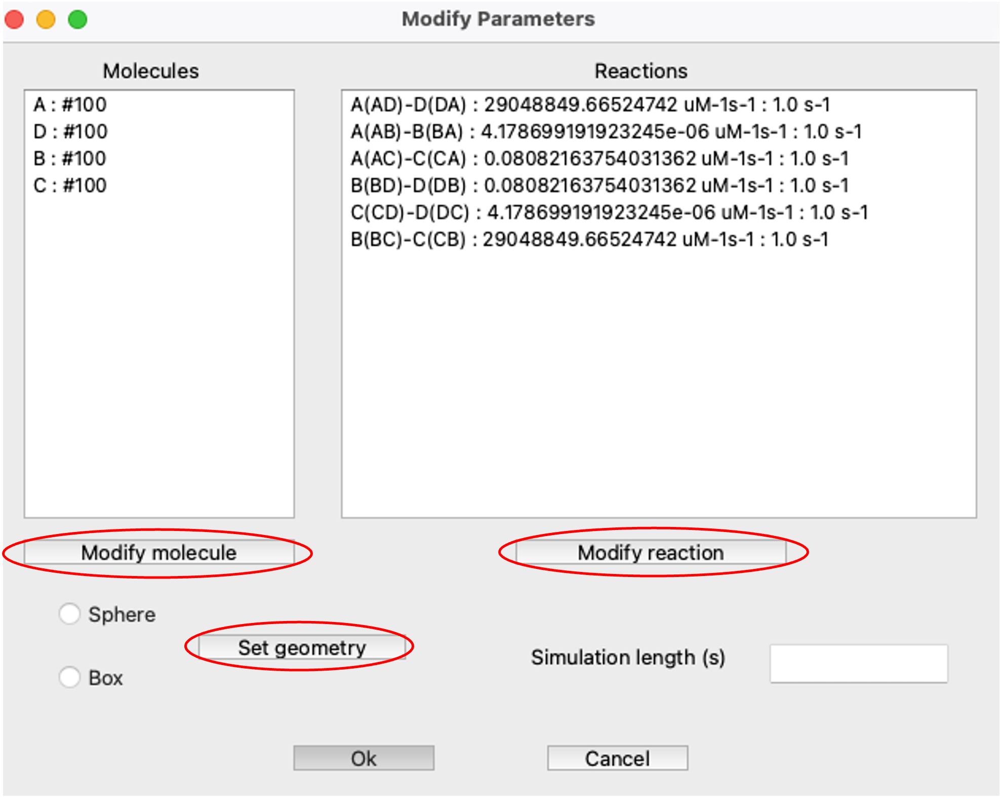
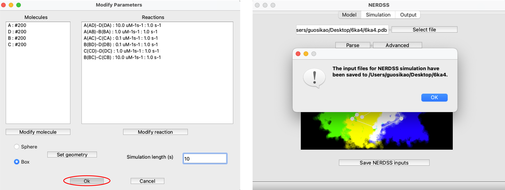
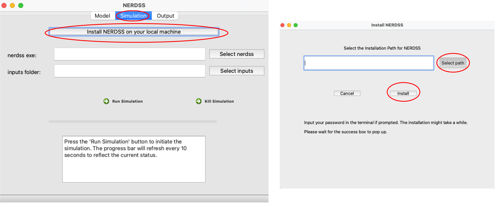
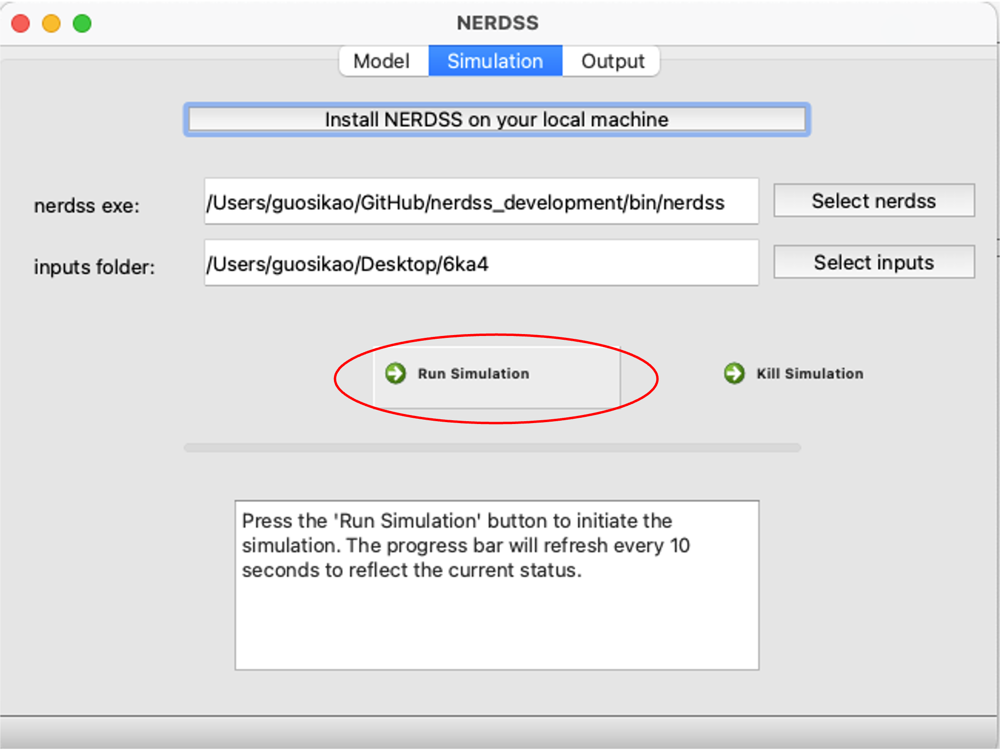
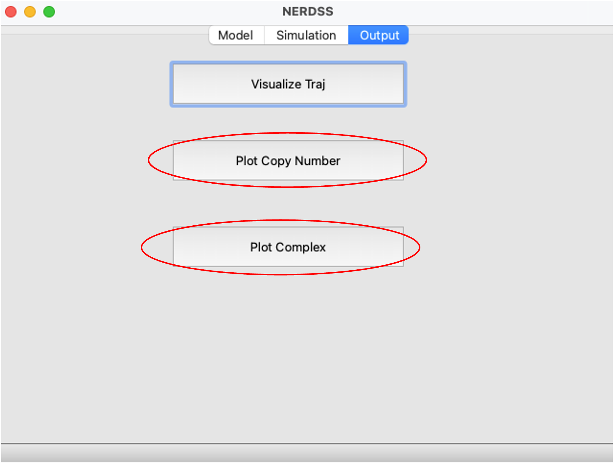
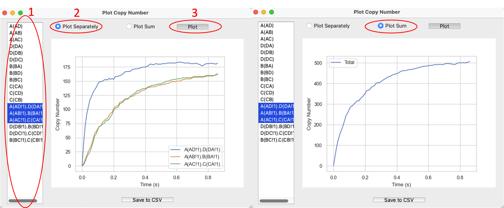
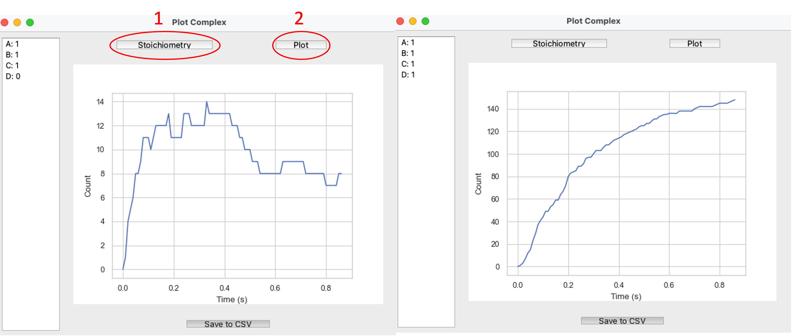

Integrated GUI for NERDSS simulation and analysis
~~~~~~~~~~~~~~~~~~~~~~~~~~~~~~~~~~~~~~~~~~~~~~~~~

.. code-block:: python

    import ionerdss as ion
    ion.nerdss()

This will open the NERDSS GUI, which allows you to prepare NERDSS inputs from PDB structure, run NERDSS simulations and analyze the results.

Setting Up Models for NERDSS Simulation Based on a PDB Structure File
^^^^^^^^^^^^^^^^^^^^^^^^^^^^^^^^^^^^^^^^^^^^^^^^^^^^^^^^^^^^^^^^^^^^^

Each chain is mapped to a single molecule type. A molecule type consists of a Center of Mass (COM) and binding sites. The COM is the average position of all atoms in the chain. A binding site is the average position of all atoms in the contact area, which is determined by considering all pairs of amino acids within a specific cutoff distance.

.. important::
    To treat homo chains as same NERDSS molecule, use the `this jupyter notebook <pdb_to_nerdss_tutorial.html>`_ to prepare the NERDSS inputs.

    PDB structure that we use in this tutorial.

Preparing and Selecting the PDB File in the User Interface
""""""""""""""""""""""""""""""""""""""""""""""""""""""""""

    Parse the PDB structure with 3 clicks.

Generating NERDSS Inputs 
""""""""""""""""""""""""

    Generate NERDSS inputs.

Modifying the Parameters as Needed
""""""""""""""""""""""""""""""""""

    Modify parameters as needed.

Clicking OK button will generate the NERDSS input files in the working directory
""""""""""""""""""""""""""""""""""""""""""""""""""""""""""""""""""""""""""""""""

    NERDSS input files saved.

Running the Simulation
^^^^^^^^^^^^^^^^^^^^^^

Clicking the Install button will install NERDSS locally
""""""""""""""""""""""""""""""""""""""""""""""""""""""""

    Install NERDSS locally.

Select nerdss executable and select the input files folder to run the simulation
""""""""""""""""""""""""""""""""""""""""""""""""""""""""""""""""""""""""""""""""

    Run the simulation.

Quickly Analyzing Simulation Outputs in the User Interface
""""""""""""""""""""""""""""""""""""""""""""""""""""""""""

    Analyze the simulation outputs.

    Graphing Copy Number of Species Over Time.

    Graphing Complex Number Over Time.