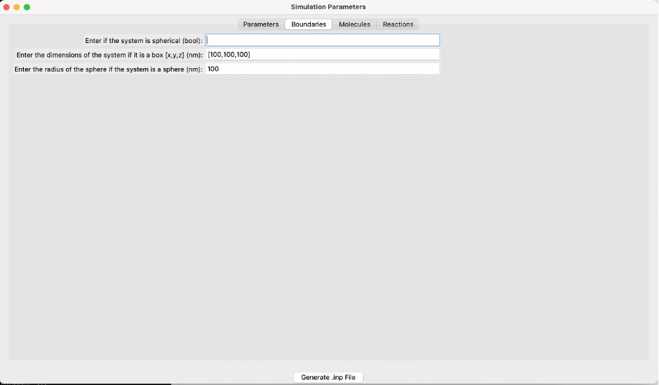

GUI to create .inp and .mol from user-defined molecules and reactions
~~~~~~~~~~~~~~~~~~~~~~~~~~~~~~~~~~~~~~~~~~~~~~~~~~~~~~~~~~~~~~~~~~~~~

Description
^^^^^^^^^^^
A graphical interface to generate `.inp` and `.mol` NERDSS input files using user input values.

Parameters
^^^^^^^^^^
None

Example
^^^^^^^
.. code-block:: python

    import ionerdss as ion
    ion.gui()

    The parameters screen of the GUI.

User Specific Parameters
""""""""""""""""""""""""

- **Total iteration (steps):**
    The length of the simulation iteration in steps.

- **TimeStep (μs):**
    The length of time between each iteration of the simulation in μs.

- **How often to write output (steps):**
    Interval which prints running time information to standard output and records the copy numbers in the _time.dat files.

- **How often to write traj (steps):**
    Interval that writes coordinates to the trajectory file.

- **How often to write pdb (steps):**
    Interval, in steps, that the pdb data is written. If -1 is input, no pdb file is output.

- **How often to write transition matrix (steps):**
    Interval, in steps, to write the transition matrix data. The transition matrix is the count of going from clusters of one size to a different size. Having the transition matrix at a fixed frequency allows analysis at different parts of the simulation (e.g., beginning, middle, late).

- **How often to write restart file (steps):**
    Iteration interval to write restart files. The restart.dat file stores all the system information to restart a simulation from the latest step.

- **How often to write check points (steps):**
    Iteration interval to write check points for the restart file.

- **Threshold for reject association root mean square displacement (<RMSD>):**
    Threshold to reject association events that result in shifts of an interface on either component by scale max displace. Due to large displacements, the rotation of large complexes into bound structures is not physically possible. <RMSD> is calculated from sqrt(6.0*Dtot*dt) in 3D, and sqrt(4.0*Dtot*dt) in 2D.

- **Threshold for overlap check between COMs (nm):**
    Threshold for overlap check applied to two molecules binding with each of those molecules between the center of masses in nanometers.

- **Whether overlap is checked based on cluster (bool):**
    If True, checks overlap based on cluster. If False, does not check overlap based on cluster. Defaults to False.

    The boundaries screen of the GUI.

Boundary Conditions
"""""""""""""""""""

- **Is the system spherical (bool):**
    If True, the system uses spherical boundaries. If False, the system uses box boundary conditions. Defaults to False.

- **Box dimensions [x, y, z] (nm):**
    Specify the dimensions of the box along the x, y, and z axes in nanometers. This is applicable only if the system is not spherical.

- **Sphere radius (nm):**
    Specify the radius of the sphere in nanometers. This is applicable only if the system is spherical.

    The molecules screen of the GUI.

User Specific Molecule Parameters
""""""""""""""""""""""""""""""""""

- **Molecule name:**
    The name of the molecule. This is a required input for the file. The name must be consistent between the `.inp` and `.mol` files if using a generated `.mol` file from a pdb file. If the system has an implicit lipid molecule, it must be in the first position of the molecules list.

- **Copy number:**
    The starting copy number of the molecules in the system.

- **Concentration (uM):**
    If the copy number is unknown, the concentration in micromolar can be input to create copy numbers for each respective molecule.

- **Check overlap (bool):**
    If True, checks overlap for the specific molecule type. If False, does not check overlap for the specific molecule type. Defaults to True.

- **Track transition matrix (bool):**
    If True, tracks the transition matrix for this molecule type. If False, does not track the transition matrix for this molecule type. Defaults to True.

- **Transition matrix size:**
    The size of the transition matrix for this molecule type. Defaults to 500. Should be larger than the size of the largest formed complex.

- **Implicit lipid (bool):**
    If True, the molecule is an implicit lipid. If False, the molecule is not an implicit lipid. Used for simulating binding to a membrane with many lipid binding sites using the implicit lipid model. Defaults to False.

- **Lipid (bool):**
    If True, the molecule is a lipid. If False, the molecule is not a lipid. Used for simulating molecules restricted to a 2D surface.

- **Translational diffusion constants ([Dx, Dy, Dz]) (μm²/s):**
    The rate of flow of particles. Specify the rate in the x, y, and z axes. Measured in μm²/s.

- **Rotational diffusion constants ([Drx, Dry, Drz]) (rad²/s):**
    The rotational motion of molecules along an axis. Measured in rad²/s.

- **Coordinates and states of all binding sites (nm):**
    Coordinates and states of all binding sites of the molecule in nanometers. Use a capital “U” to indicate unphosphorylated and a capital “P” to indicate phosphorylated.

- **Bonds between sites:**
    Bonds between the centers of mass (COMs) of each molecule.

- **Percentage of different initial states:**
    The percentage of different initial states. For example, if the molecule contains different amounts of initial states (e.g., 80% unphosphorylated and 20% phosphorylated), it would be represented as 0.8 and 0.2, respectively.

    The reactions screen of the GUI.

User Specific Reaction Parameters
"""""""""""""""""""""""""""""""""

The GUI supports creating input files for various types of reactions including unimolecular creation, bimolecular association, zeroth order creation, molecule destruction, Michaelis-Menten, bimolecular state change, and state change reactions.

- **Reactant 1’s COM coordinates for bimolecular reaction ([x, y, z]) (nm):**
    The coordinates of reactant 1’s center of mass in the x, y, and z axes. Measured in nanometers.

- **Reactant 2’s COM coordinates ([x, y, z]) (nm):**
    The coordinates of reactant 2’s center of mass in the x, y, and z axes. Measured in nanometers.

- **Microscopic on rate (nm³/μs):**
    The 3D intrinsic microscopic binding rate for the reaction. For 2D, this is converted to nm²/μs. Measured in nm³/μs.

- **Macroscopic on rate if microscopic on rate is not provided (μM⁻¹ s⁻¹):**
    Macroscopic rates are experimentally measured rates dependent on diffusion to contact and energetic barriers. Measured in μM⁻¹ s⁻¹.

- **Rate for creation/destruction/unimolecular state change/unimolecular creation (M/s):**
    Rate of reaction dependent on the type of reaction. Measured in M/s.

- **Length scale to convert 3D rate to 2D rate for bimolecular association (nm):**
    Default value is 2*σ, where σ is the distance between two reacting interfaces for a bimolecular reaction. Converts 3D rate to 2D rate and is measured in nanometers.

- **Scale factor of rate when closing loops for bimolecular association (k_a):**
    Used only when closing loops, for example, within a hexagonal lattice. Default value is 1.0.

- **Coupled reaction label:**
    Allows the completion of a reaction to cause another reaction to occur, but it must already be a listed reaction. Occurs with the rate kcat, and only applies to products of a reaction.

- **Check exclude volume for bound sites (bool):**
    If True, once two sites are in the bound state and cannot undergo additional bimolecular reactions, they will exclude volume with any other sites. If False, they will not exclude volume with any other sites. Exclude volume is the volume inaccessible to other molecules due to the first molecule's presence.

- **Reactant 1’s reaction site coordinates for bimolecular reaction ([x, y, z]) (nm):**
    The coordinates of the first reactant's reaction sites in the x, y, and z axes. Measured in nanometers.

- **Reactant 2’s reaction site coordinates ([x, y, z]) (nm):**
    The coordinates of the second reactant's reaction sites in the x, y, and z axes. Measured in nanometers.

- **Microscopic off rate (s⁻¹):**
    Microscopic dissociation rate, measured in s⁻¹.

- **Macroscopic off rate if microscopic off rate is not provided (s⁻¹):**
    Macroscopic dissociation rate, measured in s⁻¹.

- **Distance between two reactants to force reaction within the same complex for bimolecular association (σ) (nm):**
    The distance between two reacting interfaces for a bimolecular reaction. Measured in nanometers.

- **Reaction label:**
    Each reaction must have its own reaction label set so that it can be uniquely identified. For example, phosphorylateA.

- **Rate of the coupled reaction (s⁻¹):**
    Rate of a coupled reaction, kcat, if a different reaction was coupled to this one. Must be specified for the coupled reaction to occur.

Refer to the `NERDSS User Guide <nerdss_user_guide_input_output.html>`_ for more information. Click “Add Reaction” when finished. Repeat this process to enter different reactions.

When finished entering all parameters, click “Generate .inp File” to generate the `parm.inp` and `.mol` files in the current directory.

