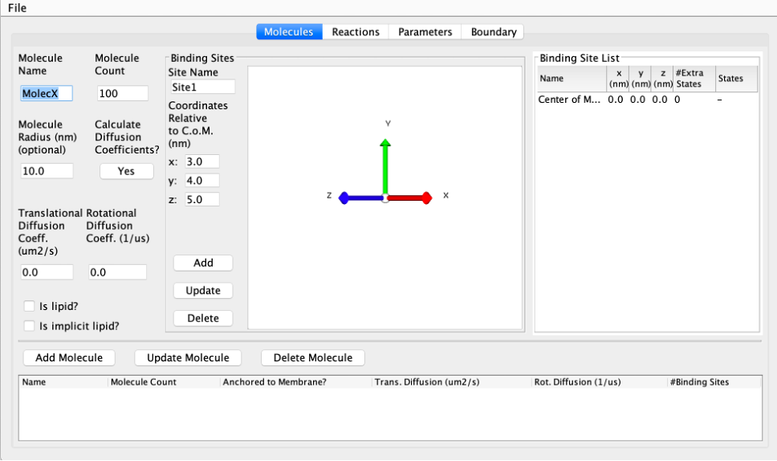
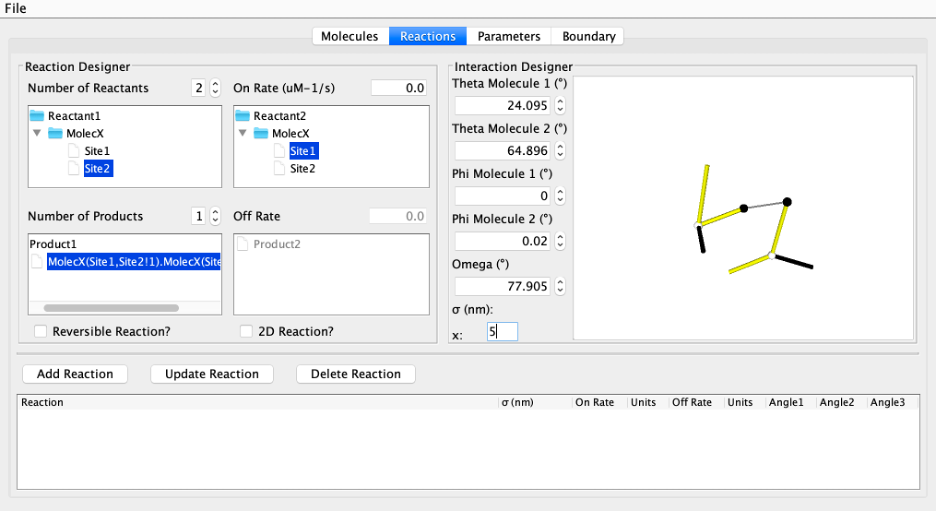

Creating Input Files With JAVA GUI
-----------------------------------

This is a Graphical Interface for creating input files for NERDSS. It allows you to define all the molecules, reactions, boundary conditions, and other parameters for your simulation. (Some new parameters may not be available in the GUI yet.)

The Molecule Screen
~~~~~~~~~~~~~~~~~~

  The Molecule Screen GUI for creating input files for NERDSS.

Above is the opening screen for the GUI. Here you can add all the individual molecules that will be included in your simulation. You must also specify each binding site as a vector from its molecule’s center of mass. Binding will occur at the terminal end of this interface vector. Each binding site must be added a molecule, and the molecule must be added to the molecule list, in order for it to appear on the reactions screen.

The Reactions Screen
~~~~~~~~~~~~~~~~~~~~

This is where you can specify all possible reactions. You can do both unimolecular and bi molecular reaction. Since there are no association angles for a unimolecular reaction, the 3D pane on the right will only appear once a bimolecular reaction is specified. 

  The Reactions Screen GUI for creating input files for NERDSS.

Sigma: Sigma is the association distance (in nm) between two interfaces. It is represented as the dotted line between the two interface vectors. Only its length may be changed - the positions of both molecules are defined relative to it.

Normal Vector: The solid black line is the normal vector. It does not have any physical significance but is used as a reference point for the phi angle, which measures the rotation of the molecule about a given interface vector.

Angles: Five angles are used to specify the geometry of association:

- **Theta (Θ)**: One for each molecule, ranging from 0 to π. Theta is the angle between the interface vector and sigma. Its axis of rotation is the cross product of the sigma vector and a given interface vector.

  .. figure:: ./fig/theta.png
    :alt: Theta Angle
    :align: center

    The Theta Angle.

- **Phi (Φ)**: One for each molecule, ranging from -π to π. Note that this range is converted to 0 to 2π when angles are output to the `.parms` file. Phi is the dihedral angle between the normal vector and the sigma vector. It defines the rotation of a molecule about its interface vector.

  .. figure:: ./fig/phi.png
    :alt: Phi Angle
    :align: center

    The Phi Angle.

- **Omega (Ω)**: Ranging from -π to π. Note that this range is converted to 0 to 2π when angles are output to the `.parms` file. Omega is the dihedral angle between the two interface vectors, with sigma as the axis of rotation.

  .. figure:: ./fig/omega.png
    :alt: Omega Angle
    :align: center

    The Omega Angle.

There may be some minor graphical behavior when changing omega. The display is corrected quickly and this will not affect simulations.

Note that the angle spinners may not exactly reach boundary conditions (e.g., theta may not get all the way to 180 degrees or down to -180 degrees). When simulation input files are created, these angles will be set to the boundaries. The GUI outputs angles with a precision of 1 degree. Although the angles are displayed in degrees on the spinners for easy interpretability, they are always stored internally and written to the `.parms` file in radians.

On Rate: `onRate3Dka` (required for all reactions) - Specifies the association rate constant.

Off Rate: `offRatekb` (required for reversible reactions) - Specifies the dissociation rate constant. Ensure that reversible reactions do not have an Off Rate of 0, as this may cause errors.

2D Reaction: Indicates whether the reaction is limited to species on a 2D surface (e.g., a membrane).

Managing Reactions:

- **Add Reaction**: Click to add the current reaction to the simulation.

- **Update Reaction**: Select a reaction from the list, modify its parameters, and click to update.

- **Delete Reaction**: Select a reaction from the list and click to remove it from the simulation.

The Parameters Screen
~~~~~~~~~~~~~~~~~~~~~

- **Time Step**: The duration of each simulation iteration in microseconds (µs).

- **Number of Time Steps**: The total number of iterations for the simulation.

- **Frequency to Print Configuration**: The number of iterations between each print of the current configuration.

- **Frequency to Print Statistics**: The number of iterations between each print of the current statistics.

- **Frequency to Print Restart File**: The number of iterations between each print of a restart file. The restart file can be used to resume the simulation from this point at a later time.

The Boundary Screen
~~~~~~~~~~~~~~~~~~~

Currently, the GUI supports only box boundary conditions. For spherical boundaries, you need to manually edit the output parameter files.

- **Box Dimensions**: Specify the dimensions of the simulation box along the x, y, and z axes.

Creating Parameter Files
~~~~~~~~~~~~~~~~~~~~~~~~

To generate `.mol` and `.parm` files for running simulations, click on "Create Parameter Input Files" and select the directory to save them. Ensure these files are placed in the same directory as the nerdss executable to run the simulations.
