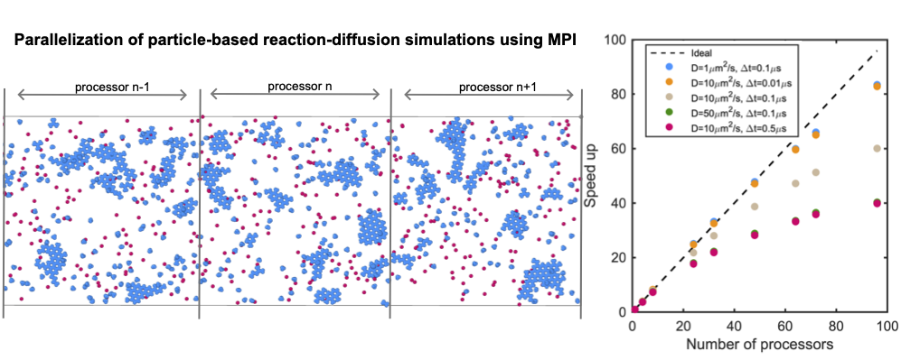

===============================
NERDSS parallel Developer Guide
===============================

Non-Equilibrium Reaction Diffusion Self-Assembly Simulator Parallel Version Using MPI.

For more detailed information, refer to the paper: `Parallelization of particle-based reaction-diffusion simulations using MPI <https://www.biorxiv.org/content/10.1101/2024.12.06.627287v1>`_.

    Parallel NERDSS Implementation.

.. toctree::
   :maxdepth: 1

   parallel_nerdss_serial_nerdss
   parallel_nerdss_parallel_nerdss
